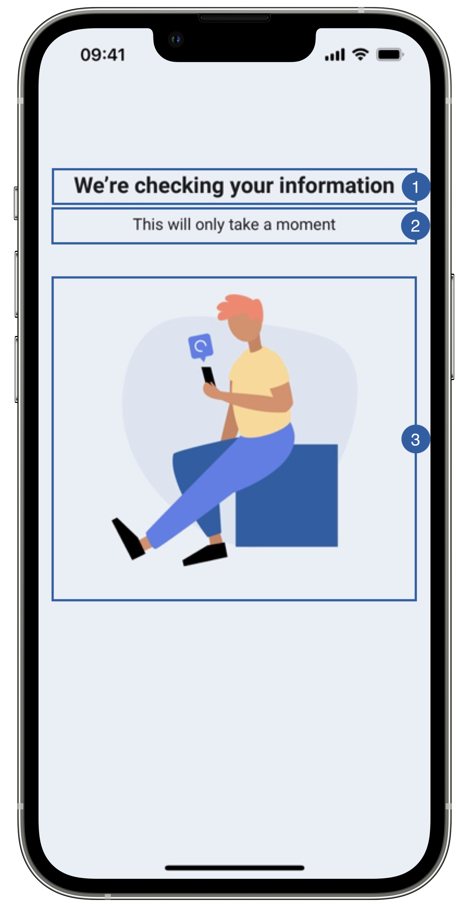

# Loading View

The only view of the biometric match flow is the loading view, it appears when the feature is initializing.
In this step, a service is called so that the biometric match is done on the server side.

{: style="height:600px;width:300px;display: block; margin: 0 auto"}

It contains a title(1), a message(2), an image(3) and a background that can be customized. 

## Branding

You can apply your own branding to our screens by overriding the resources we use.

### Text resources

=== "Android"

    You can add your own texts and localization by overriding the following string resources:
    ```xml
    <string name="biometric_face_match_title_sdk_enrolment">We’re checking your information</string>
    <string name="common_loading_message_sdk_enrolment">This will only take a moment</string>
    ```

=== "iOS"

    The best way to override strings is by adding your key through the Theme class
    
    ``` swift
    Theme.shared.strings.faceMatch.loadingTitle.localized()
    Theme.shared.strings.faceMatch.loadingMessage.localized()
    ```

### Colors
=== "Android"

    You can change the text colors by overriding the following color resource (It affects all texts):
    ```xml
    <color name="colorFaceCaptureTxtDarkSdkEnrolment">#1A1C1E</color>
    ```

    You can change the background color by overriding the following color resource:
    ```xml
    <color name="colorOverlayFeedbackBgSdkEnrolment">#EAEEF6</color>
    ```

=== "iOS"

    You can change the text colors by overriding the following color in Theme class (It affects all Loading Screens):
    
    ``` swift
    Theme.shared.colors.checkPermission.title
    Theme.shared.colors.checkPermission.subtitle
    ```
    
    You can change the background color by overriding the following color in Theme class(It affects all Loading Screens):

    ``` swift
    Theme.shared.colors.checkPermission.background
    ```

### Styles
=== "Android"

    You can extend the styles we use and override any properties (textColor, textSize, fontFamily, etc...) you want.
    ```xml
    <style name="Theme.Sdk.Enrolment.TextView.Dark.Title.Centered">
    <style name="Theme.Sdk.Enrolment.TextView.Dark.Subtitle.Centered">
    ```
    Note: It will affect every component that uses the same style.

=== "iOS"

    You can change the font through the theme class (this will affect all text in the app):
    ``` swift
    Theme.shared.fonts.bold
    Theme.shared.fonts.regular
    ```

### Image

=== "Android"

    You can change the loading image by adding a drawable with this name:
    ```xml
    ic_verification_loading.xml
    ```
    The image we are using is 240x240dp.

=== "iOS"
    
    You can change the loading image by overriding the following image name in Theme class
    ``` swift
    Theme.shared.images.faceMatch.matchLoading
    ```

## Use your own layouts

=== "Android"
    To use your own loading screen for face match feature, you need to implement the MobileID SDK Interface for that view.

    In this case: **ICustomBiometricFaceMatch.LoadingView**
    ``` kotlin
    interface LoadingView {
        fun onPreFeatureLoading()
        fun onServerCommunication()
        fun onPreparingFeature()
        fun hideLoading()
    }
    ```
    You can use the functions above to change loading screen texts in runtime, or you can opt to ignore those functions.
    
    For example create a class [BiometricMatchLoadingCustomView](https://github.com/vbmobile/mobileid-android-sample/blob/main/customized_app/src/main/java/com/example/customized_app/presentation/biometricMatch/customViews/BiometricMatchLoadingCustomView.kt), create a layout file and bind it.

    ```kotlin
    class BiometricMatchLoadingCustomView (
        context: Context
    ) : LinearLayoutCompat(context), ICustomBiometricFaceMatch.LoadingView {
        private var binding: ViewBiometricMatchLoadingBinding
    
        init {
            binding = ViewBiometricMatchLoadingBinding.inflate(LayoutInflater.from(context), this)
            orientation = VERTICAL
            gravity = Gravity.CENTER
        }
    
        override fun onPreFeatureLoading() {
            // Do nothing
        }
    
        override fun onServerCommunication() {
            binding.tvFaceMatchLoadingTitle.text = "Initializing Biometric Match"
            binding.tvFaceMatchLoadingMessage.text = "Loading, please wait.."
        }
    
        override fun onPreparingFeature() {
            binding.tvFaceMatchLoadingTitle.text = "Matching biometrics"
            binding.tvFaceMatchLoadingMessage.text = "Please wait.."
        }
    
        override fun hideLoading() {
            // Do nothing
        }
    }
    ```

=== "iOS"

    You need to register a class of type **BiometricMatchLoadingViewType** through the following function of **EnrolmentViewRegister**
    ``` swift
    public func registerBiometricMatchLoadingView(_ viewType: BiometricMatchLoadingViewType)
    ```
    
    The **BiometricMatchLoadingViewType** class needs to respect the following protocols:
    
    ``` swift
    public protocol BiometricMatchLoadingViewInterface : FeatureLoadingViewInterface {
        func onPreparingFeature()
    }   

    public typealias BiometricMatchLoadingViewType = BiometricMatchLoadingView.Type
    public typealias BiometricMatchLoadingView = UIView & BiometricMatchLoadingViewInterface
    
    public protocol FeatureLoadingViewInterface {
        func onPreFeatureLoading()
        func onPostFeatureLoading()
        func hideLoading()
    }

    public typealias FeatureLoadingViewType = FeatureLoadingView.Type
    public typealias FeatureLoadingView = UIView & FeatureLoadingViewInterface
    ```
    
    Example:
    ``` swift
    class LoadingView: LoadingOverlayView {
    // MARK: - Initialization

        override init(frame: CGRect) {
            super.init(frame: frame)
            //add any UI customization you need
        }
        
    // MARK: - Functions

        func onPreparingFeature() {
            //add any UI customization you need
        }
    
        func onPreFeatureLoading() {
            //add any UI customization you need
        }
        
        func onPostFeatureLoading() {
            //add any UI customization you need
        }
        
        func hideLoading() {
            //You can stop animations or other activities that consumes resources 
        }
    }
    ```
