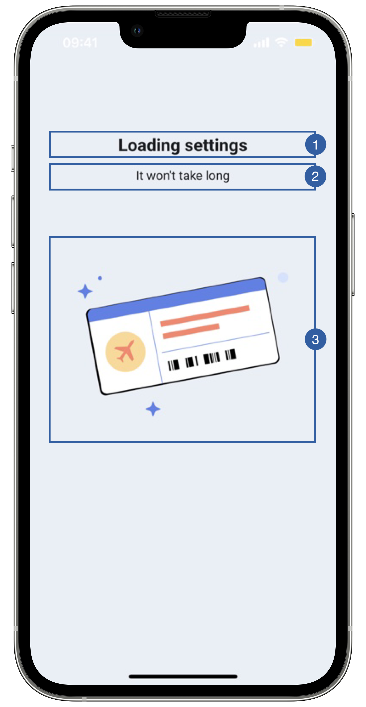

# Loading View

The first view of the Boarding pass flow is the loading view, it appears when the boarding pass feature is initializing.

{: style="height:600px;width:300px;display: block; margin: 0 auto"}

It contains a title(1), a message(2), an image(3) and a background that can be customized.

## Branding

You can apply your own branding to our screens by overriding the resources we use.

### Text resources

=== "Android"

    You can add your own texts and localization by overriding the following string resources:
    ```xml
    <string name="boarding_pass_loading_title_sdk_enrolment">Loading settings</string>
    <string name="boarding_pass_loading_subtitle_sdk_enrolment">It won\'t take long</string>
    ```

=== "iOS"

    The best way to override strings is by adding your key through the Theme class
    ``` swift
    Theme.shared.strings.boardingPassScan.initialization
    Theme.shared.strings.boardingPassScan.initializationSubtitle
    ```

### Colors
=== "Android"

    You can change the text colors by overriding the following color resource (It affects all texts):
    ```xml
    <color name="colorFaceCaptureTxtDarkSdkEnrolment">#1A1C1E</color>
    ```

    You can change the background color by overriding the following color resource:
    ```xml
    <color name="colorOverlayFeedbackBgSdkEnrolment">#EAEEF6</color>
    ```

=== "iOS"

    You can change the text colors by overriding the following color in Theme class (It affects all Loading Screens):
    ``` swift
    Theme.shared.colors.checkPermission.title
    Theme.shared.colors.checkPermission.subtitle
    ```
    You can change the background color by overriding the following color in Theme class(It affects all Loading Screens):
    ``` swift
    Theme.shared.colors.checkPermission.background
    ```

### Styles
=== "Android"

    You can extend the styles we use and override any properties (textColor, textSize, fontFamily, etc...) you want.
    ```xml
    <style name="Theme.Sdk.Enrolment.TextView.Dark.Title.Centered">
    <style name="Theme.Sdk.Enrolment.TextView.Dark.Subtitle.Centered">
    ```
    Note: It will affect every component that uses the same style.

=== "iOS"

    You can change the font through the theme class (this will affect all text in the app):
    ``` swift
    Theme.shared.fonts.bold
    Theme.shared.fonts.regular
    ```

### Animation

=== "Android"

    You can change the loading animation by adding a raw json animation file with this name:
    ```xml
    loading_boardingpass_sdk_enrolment
    ```

=== "iOS"

    You can change the loading animation by adding a raw json animation file and overriding the following animation name in Theme class
    ``` swift
    Theme.shared.animations.boardingPass.loadingBoardingPass
    ```

## Use your own layouts

=== "Android"

    To use your own loading screen for boarding pass feature, you need to implement the MobileID SDK Interface for that view.

    In this case: **ICustomBoardingPass.LoadingView**
    ``` kotlin
    interface LoadingView {
        fun onPreFeatureLoading()
        fun onFeatureLoading()
        fun onPostFeatureLoading()
        fun hideLoading()
    }
    ```
    You can use the functions above to change loading screen texts in runtime, or you can opt to ignore those functions.
    
    For example create a class [BoardingPassLoadingCustomView](https://github.com/vbmobile/mobileid-android-sample/blob/main/customized_app/src/main/java/com/example/customized_app/presentation/readBoardingPass/customViews/BoardingPassLoadingCustomView.kt), create a layout file and bind it.

    ```kotlin
    class BoardingPassLoadingCustomView(context: Context) :
    ConstraintLayout(context), ICustomBoardingPass.LoadingView {
    private var binding: ViewBoardingPassLoadingBinding
    
        init {
            binding = ViewBoardingPassLoadingBinding.inflate(LayoutInflater.from(context), this)
        }
    
        override fun onPreFeatureLoading() {
            // Do nothing
        }
    
        override fun onFeatureLoading() {
            // Do nothing
        }
    
        override fun onPostFeatureLoading() {
            // Do nothing
        }
    
        override fun hideLoading() {
            // Do nothing
        }
    }
    ```

=== "iOS"

    You need to register a class of type **BoardingPassLoadingViewType** through the following function of **EnrolmentViewRegister**
    ``` swift
    public func registerBoardingPassScannerLoadingView(_ viewType: BoardingPassLoadingViewType)
    ```
    
    The **BoardingPassLoadingViewType** class needs to respect the following protocols:
    
    ``` swift
    public protocol BoardingPassLoadingViewInterface: FeatureLoadingView {}   

    public typealias BoardingPassLoadingViewType = BoardingPassLoadingView.Type
    public typealias BoardingPassLoadingView = UIView & BoardingPassLoadingViewInterface
    
    public protocol FeatureLoadingViewInterface {
        func onPreFeatureLoading()
        func onPostFeatureLoading()
        func hideLoading()
    }

    public typealias FeatureLoadingViewType = FeatureLoadingView.Type
    public typealias FeatureLoadingView = UIView & FeatureLoadingViewInterface
    ```
    
    Example:
    ``` swift
    class LoadingView: BoardingPassLoadingView {
    
    // MARK: - Initialization

        override init(frame: CGRect) {
            super.init(frame: frame)
            //add any UI customization you need
        }
        
    // MARK: - Functions

        func onPreFeatureLoading() {
            //add any UI customization you need
        }

        func onPostFeatureLoading() {
            //add any UI customization you need
        }   

        func hideLoading() {
            //You can stop animations or other activities that consumes resources 
        }
    }
    ```