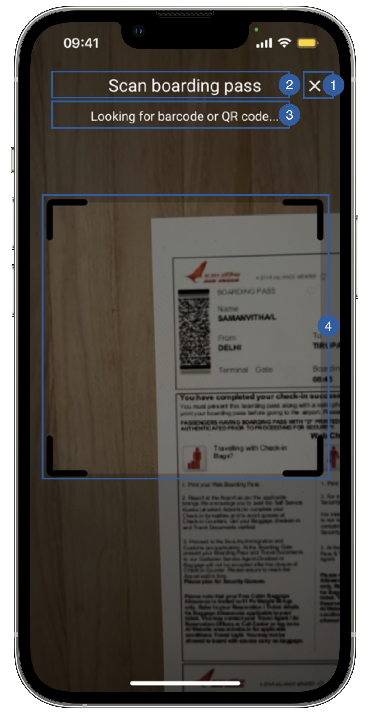

# Scan View

The second view of the Boarding pass flow is the scan view, it's the camera screen that detects the boarding pass barcode.

{: style="height:600px;width:300px;display: block; margin: 0 auto"}

It contains a cancel button (1), a title(2), a message(3) and a frame(4) that can be customized.

## Branding

You can apply your own branding to our screens by overriding the resources we use.

### Text resources

=== "Android"

    You can add your own texts and localization by overriding the following string resources
    ```xml
    <string name="boarding_pass_loading_bt_scan_sdk_enrolment">Scan boarding pass</string> <!--Title -->
    <string name="boarding_pass_scan_subtitle_sdk_enrolment">Looking for barcode or QR code…</string> <!-- Subtitle -->
    ```

=== "iOS"

    The best way to override strings is by adding your key through the Theme class
    ``` swift
    Theme.shared.strings.boardingPassScan.scanTilte
    Theme.shared.strings.boardingPassScan.scanSubtilte
    ```

### Colors
=== "Android"

    You can change the text colors by overriding the following color resource (It affects all texts)
    ```xml
    <color name="colorFaceCaptureTxtLightSdkEnrolment">#DFFFFFFF</color>
    ```

    You can change the background color by overriding the following color resource
    ```xml
    <color name="colorBarcodeScanBgSdkEnrolment">#000000</color>
    ```

=== "iOS"

    You can change the text colors by overriding the following color in Theme class(affects both title and subtitle):
    ``` swift
    Theme.shared.colors.boardingPassScan.title
    ```
    You can change the color of the mask (also affects BiometricFaceCapture):
    ``` swift
    Theme.shared.colors.component.transparentOverlay
    ```
    You can change the color of the frame (also affects Face Capture and Document Reader)
    ``` swift
    Theme.shared.colors.common.black
    ```
    
### Styles
=== "Android"

    You can extend the style we use and override any properties (textColor, textSize, fontFamily, etc...) you want.
    ```xml
    <style name="Theme.Sdk.Enrolment.TextView.Dark.Title.Centered">
    <style name="Theme.Sdk.Enrolment.TextView.Dark.Subtitle.Centered">
    ```
    Note: It will affect every component that uses the same style.

=== "iOS"

    You can change the font through the theme class (this will affect all text in the app):
    ``` swift
    Theme.shared.fonts.regular
    ```

### Images

=== "Android"

    You can change the cancel button icon by adding a drawable with this name:
    ```xml
    ic_cancel_sdk_enrolment.xml
    ```
    The image we are using is 24x24dp

    You can change the frame by adding a drawable with this name:
    ```xml
    barcode_scan_mask_sdk_enrolment.xml
    ```
    The image we are using is 320x320dp

=== "iOS"

    You can change the image by adding a asset file and overriding the following image name in Theme class
    ``` swift
    Theme.shared.images.buttons.closeButton // It affects all close buttons
    ```