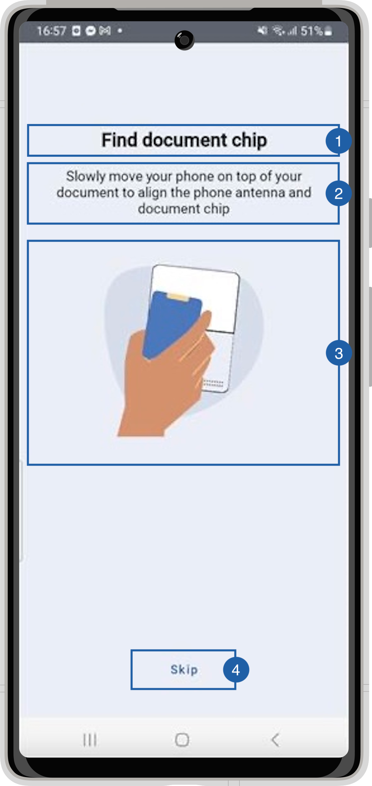

# Find Chip View

{: style="height:600px;width:300px;display: block; margin: 0 auto"}

It contains a title(1), a message(2), an animation(3), a skip Button(4) and a background that can be customized. 

## Branding

You can apply your own branding to our screens by overriding the resources we use.

### Text resources

You can add your own texts and localization by overriding the following string resources:

```xml
<resources>
    <string name="rfid_read_title_sdk_enrolment">Find document chip</string>
    <string name="rfid_read_subtitle_sdk_enrolment">Slowly move your phone on top of your document to align the phone antenna and document chip</string>
</resources>
```

### Colors

You can change the colors of text elements and the background by overriding the following color resource (It affects all texts):

```xml
<resources>
    <!-- Change the text color -->
    <color name="colorFaceCaptureTxtDarkSdkEnrolment">#1A1C1E</color>
    <!-- Change the background color -->
    <color name="colorDocumentReadRFIDBgSdkEnrolment">#EAEEF6</color>
</resources>
```

### Styles

You can extend the styles we use and override any properties (textColor, textSize, fontFamily, etc...) you want.
```xml
<resources>
    <style name="Theme.Sdk.Enrolment.TextView.Dark.Title.Centered"></style>
    <style name="Theme.Sdk.Enrolment.TextView.Dark.Subtitle.Centered"></style>
</resources>
```
Note: It will affect every component that uses the same style.

### Animation

You can change the animation by adding a raw json animation file with this name:

- chip_read_reading_sdk_enrolment.json

## Use your own layouts

To use your own custom screens for document reader feature, you need to implement the MobileID SDK Interface for that view.
In this case: **ICustomDocumentReader.RfidSearchView**
``` kotlin
interface RfidSearchView {
    fun getSkipButton(): View?
    fun hideSearch()
}
```

getSkipButton should return a button view to allow the user to skip Chip reading, if you don't want this to be possible, simply return null here.
hideSearch is called when the view is dismissed to allow you to clean your variables and stop animations. 

For example create a class [RfidReadCustomView](https://github.com/vbmobile/mobileid-android-sample/blob/main/customized_app/src/main/java/com/example/customized_app/presentation/readDocument/customViews/RfidReadCustomView.kt), create a layout file and bind it.

```kotlin
class RfidReadCustomView(
    context: Context
) : ConstraintLayout(context), ICustomDocumentReader.RfidReadView {
    private var binding: ViewRfidReadBinding

    init {
        binding = ViewRfidReadBinding.inflate(LayoutInflater.from(context), this)
    }

    override fun getSkipButton() = binding.btnSkip
    override fun hideSearch() {
        // Do nothing
    }
}
```