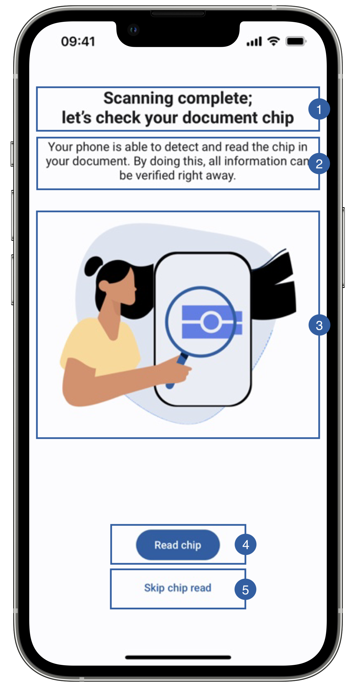

# RFID Instructions View

The third view of the document reader flow is the RFID Read View, this screen only appears if it is an e-Document and the variable **readRFID** from **ReadDocumentParameters** is active. This screen allows the user to prepare for the chip reading or skip this feature.

{: style="height:600px;width:300px;display: block; margin: 0 auto"}

It contains a title(1), a message(2), an image(3), a read button(4), a skip button(5) and a background that can be customized. 

## Branding

You can apply your own branding to our screens by overriding the resources we use.

### Text resources

=== "Android"

    You can add your own texts and localization by overriding the following string resources:
    ```xml
    <string name="rfid_instructions_read_title_sdk_enrolment">Scanning complete;\nlet\'s scan your document chip.</string>
    <string name="rfid_instructions_read_subtitle_sdk_enrolment">Your phone is able to detect and read the chip in your document. By doing this, all information can be verified right away.</string>
    <string name="rfid_instructions_read_sdk_enrolment">Read chip</string>
    <string name="rfid_instructions_skip_read_sdk_enrolment">Skip chip read</string>
    ```

=== "iOS"

    The best way to override strings is by adding your key through the Theme class
    
    ``` swift
    Theme.shared.strings.rfid.rfidReadTitle
    Theme.shared.strings.rfid.rfidReadSubtitle
    Theme.shared.strings.buttons.readChip
    Theme.shared.strings.buttons.skipChipRead
    ```

### Colors
=== "Android"

    You can change the text colors by overriding the following color resource (It affects all texts):
    ```xml
    <color name="colorFaceCaptureTxtDarkSdkEnrolment">#1A1C1E</color>
    ```

    You can change the background color by overriding the following color resource:
    ```xml
    <color name="colorDocumentReadRFIDBgSdkEnrolment">#EAEEF6</color>
    ```

=== "iOS"

    You can change the text colors by overriding the following color in Theme class:
    ``` swift
    Theme.shared.colors.rfidData.title
    Theme.shared.colors.rfidData.subtitle
    ```
    
    You can change the background color by overriding the following color in Theme class:
    ``` swift
    Theme.shared.colors.rfidData.background
    ```

    You can change the color of the read button (this affects all primary style buttons)
    ``` swift
    Theme.shared.colors.button.primaryBackground
    Theme.shared.colors.button.primaryTitle
    ```
    
    You can change the color of the skip button (this affects all secondary style buttons)
    ``` swift
    Theme.shared.colors.button.secondaryBackground
    Theme.shared.colors.button.secondaryTitle
    ```
    
### Styles
=== "Android"

    You can extend the styles we use and override any properties (textColor, textSize, fontFamily, etc...) you want.
    ```xml
    <style name="Theme.Sdk.Enrolment.TextView.Dark.Title.Centered">
    <style name="Theme.Sdk.Enrolment.TextView.Dark.Subtitle.Centered">
    ```
    Note: It will affect every component that uses the same style.

=== "iOS"

    You can change the font through the theme class (this will affect all text in the app):
    ``` swift
    Theme.shared.fonts.bold
    Theme.shared.fonts.regular
    ```

### Image

=== "Android"

    You can change the image by adding a drawable with this name:
    ```xml
    ic_read_chip_instructions.xml
    ```
    The image we are using is 208x208dp.

=== "iOS"
    
    You can change the image by adding a asset file and overriding the following image name in Theme class
    ``` swift
    Theme.shared.images.documentReader.rfiDescription
    ```

## Use your own layouts

=== "Android"

    To use your own custom screens for document reader feature, you need to implement the MobileID SDK Interface for that view.

    In this case: **ICustomDocumentReader.RfidInstructionsView**
    ``` kotlin
    interface RfidInstructionsView{
        fun getReadChipButton(): View?
        fun getSkipButton(): View?
        fun hideInstructions()
    }
    ```

    - getReadChipButton method must return a Button to start the rfid reading, when clicked it will also start the timeout.
    - getSkipButton can return either null or a button/image to skip the rfid reading.
    - hideInstructions is called when the view is dismissed.
    
    For example create a class [RfidTutorialCustomView](https://github.com/vbmobile/mobileid-android-sample/blob/main/customized_app/src/main/java/com/example/customized_app/presentation/readDocument/customViews/RfidTutorialCustomView.kt), create a layout file and bind it.

    ```kotlin
    class RfidTutorialCustomView(
    context: Context
    ) : ConstraintLayout(context), ICustomDocumentReader.RfidInstructionsView {
    private var binding: ViewRfidTutorialBinding // Requires view binding enabled
    // private var view: View
    
        init {
            binding = ViewRfidTutorialBinding.inflate(LayoutInflater.from(context), this)
            // You can also use other inflate method like this:
            // view = inflate(context, R.layout.view_rfid_tutorial, this)
        }
        override fun getReadChipButton() = binding.btnReadChip
        // override fun getReadChipButton(): View = view.findViewById(R.id.btn_read_chip)
    
        override fun getSkipButton() = binding.btnSkip
    
        override fun hideInstructions() {
            // Do nothing
        }
    }
    ```
    
=== "iOS"

    You need to register a class of type **DocumentReaderRFIDInstructionsViewType** through the following function of **EnrolmentViewRegister**
    ``` swift
    public func registerDocumentReaderRFIDInstructionsView(_ viewType: DocumentReaderRFIDInstructionsViewType)
    ```
    
    The **DocumentReaderRFIDInstructionsViewType** class needs to respect the following protocols:
    
    ``` swift
    public protocol DocumentReaderRFIDInstructionsViewInterface {
        var delegate: DocumentReaderRFIDInstructionsViewDelegate? { get set }
        func hideInstructions()
    }

    public protocol DocumentReaderRFIDInstructionsViewDelegate: AnyObject {
        func didPressReadChipButton()
        func didPressSkipButton()
    }

    public typealias DocumentReaderRFIDInstructionsViewType = DocumentReaderRFIDInstructionsView.Type
    public typealias DocumentReaderRFIDInstructionsView = UIView & DocumentReaderRFIDInstructionsViewInterface
    ```
    
    Example:
    ``` swift
    class RFIDReadView: DocumentReaderRFIDInstructionsView {
    
        weak var delegate: DocumentReaderRFIDInstructionsViewDelegate?
    
    // MARK: - Initialization

        override init(frame: CGRect) {
            super.init(frame: frame)
            //add any UI customization you need
        }
        
    // MARK: - Actions

        @objc private func readChipButtonTapped(button: UIButton) {
            delegate?.didPressReadChipButton()
        }

        @objc private func skipButtonTapped(button: UIButton) {
            delegate?. didPressSkipButton()
        }
    
    // MARK: - Functions

        func hideInstructions() {
            //You can stop animations or other activities that consumes resources 
        }
    }
    ```

