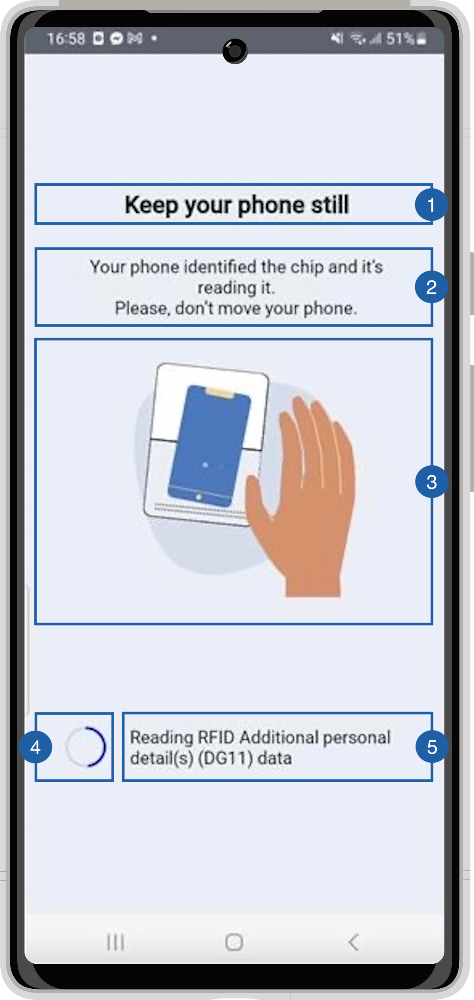

# Read Chip View

{: style="height:600px;width:300px;display: block; margin: 0 auto"}

It contains a title(1), a message(2), an animation(3), a loading spinner(4), a loading message(5) and a background that can be customized. 

## Branding

You can apply your own branding to our screens by overriding the resources we use.

### Text resources

You can add your own texts and localization by overriding the following string resources:

```xml
<resources>
    <string name="nfc_tag_detected_title_loading_sdk_enrolment">Keep your phone still</string>
    <string name="nfc_tag_detected_subtitle_loading_sdk_enrolment">Your phone identified the chip and it’s reading it.\nPlease, don’t move your phone.</string>
</resources>
```


### Colors

You can change the colors of text elements, the background and/or the spinner in the bottom area 
that shows the progress of the RFID reading by overriding the following color resource (It affects all texts):

```xml
<resources>
    <!-- Change the text color -->
    <color name="colorFaceCaptureTxtDarkSdkEnrolment">#1A1C1E</color>
    <!-- Change the background color -->
    <color name="colorOverlayFeedbackBgSdkEnrolment">#EAEEF6</color>
    <!-- Change the spinner colors -->
    <color name="colorProgressBarSecondaryProgressSdkEnrolment">#CFD8DC</color>
    <color name="colorProgressBarPrimaryProgressSdkEnrolment">#0000FF</color>
</resources>
```

### Styles

You can extend the styles we use and override any properties (textColor, textSize, fontFamily, etc...) you want.
```xml
<resources>
    <style name="Theme.Sdk.Enrolment.TextView.Dark.Title.Centered"></style>
    <style name="Theme.Sdk.Enrolment.TextView.Dark.Subtitle.Centered"></style>
</resources>
```
Note: It will affect every component that uses the same style.

### Animation

You can change the animation by adding a raw json animation file with this name:

- chip_read_finding_sdk_enrolment.json for the large animation

You can change the spinner  animation by adding a drawable file with this name:

- pb_progress_bar_style.xml

## Use your own layouts

To use your own custom screens for document reader feature, you need to implement the MobileID SDK Interface for that view.
In this case: **ICustomDocumentReader.RfidProcessView**
``` kotlin
interface RfidProcessView {
    fun updateRFIdStatus(text: String, progress: Int)
    fun hideProcess()
}
```

updateRfidStatus is called when the progress of the chip reading changes. 

Since this stage takes multiple different readings:
- The text variable contains information sent by Regula to identify what's being read at the moment. 
- The progress variable is a 0-100 variable that display the percentage read of that component.

For example create a class [RfidProcessCustomView](https://github.com/vbmobile/mobileid-android-sample/blob/main/customized_app/src/main/java/com/example/customized_app/presentation/readDocument/customViews/RfidProcessCustomView.kt), create a layout file and bind it.

```kotlin
class RfidProcessCustomView(
    context: Context
) : ConstraintLayout(context), ICustomDocumentReader.RfidProcessView {
    private var binding: ViewRfidProcessBinding

    init {
        binding = ViewRfidProcessBinding.inflate(LayoutInflater.from(context), this)
    }

    override fun updateRFIdStatus(text: String, progress: Int) {
        binding.tvRfidProcessMessage.text = "$text| $progress%"
    }

    override fun hideProcess() {
        // Do nothing
    }
}
```