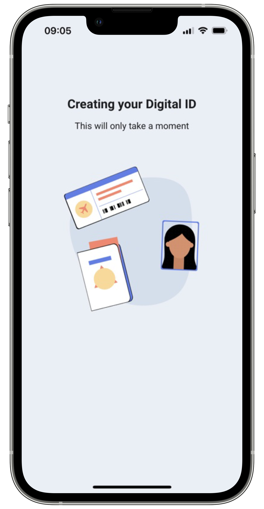

# Subject Manager

A `Subject` consists of a set of data that represents a digital ID in the enrolment process. The
Mobile ID SDK provides the ability to build and create such `Subject`.

## Use Subject Manager

You can manage subjects using the subject management functions available in the enrolment facade.
Subjects are the result of the enrolment process and need to be successfully created in the
server-side platform, to complete any process requiring a digital form of identification. The subject will always be null
when returned from the facade's method subject builder. This field will only be filled by our
backend services, depending on if the subject is fully authenticated or not. If the user is not
fully authenticated, the subject token will be filled only on when the app fetches the subject on
the facade's get subject method. If the subject token is not null, it will contain a base 64 QR code
that the user must present on the physical gate for a full authentication.

=== "Android"

    ```kotlin
    data class Subject(
        val id: String?,
        val language: String,
        val document: Document,
        val biometrics: List<Biometric>,
        val validationStatus: ValidationStatus,
        val subjectToken: SubjectToken?,
        var boardingPass: BoardingPass? = null
    )
    ```
    
=== "iOS"

    ``` swift
    public struct Subject {
        public let id: String
        public let document: Document
        public let biometrics: [Biometric]?
        public var boardingPass: BoardingPass?
        public var validationStatus: ValidationStatus
        public var subjectToken: SubjectToken?
        public var language: Locale
        public var formData: [FormAnswer]?
    }
    ```

The subject `id` will be generated and returned upon adding it for the first time.
    
The SubjectToken will have the following structure:

=== "Android"

    The SubjectToken will also provide a method to return the QR code as a bitmap. For this you just
    need to call the method getQRCodeImage().
    
    ```kotlin
    data class SubjectToken(
        val qrCodeBase64: String
    )
    ```
  
=== "iOS"

    ``` swift
    public struct SubjectToken {
        public var qrCodeBase64: String
        public var qrCodeImage: UIImage?
    }
    ```
    
The ValidationStatus will have the following structure:   

=== "Android"

    ```kotlin
    data class ValidationStatus(
        val documentAuthenticated: Boolean,
        val livenessCheckPassed: Boolean,
        val biometryMatched: Boolean
    )
    ```
  
=== "iOS"

    ``` swift 
    public struct ValidationStatus {
        /// Field indicating if the Enrolment photos matched.
        public var biometryMatched: Bool
        /// Field indicating if the liveness check test was performed with success.
        public var livenessCheckPassed: Bool
        /// Field indicating if the RFID scan of the document was performed with success.
        public var documentAuthenticated: Bool
    }
    ```

Check the [Document](../DocumentReader/DocumentReader_Index.md), [BoardingPass](../BoardingPass/BoardingPass_Index.md) and [Biometric](#biometric) pages for more information about the remaining attributes.

## Subject operations

You can create a new subject using the `addSubject` method.
`Subject` data can be automatically submitted to the server-side platform after a successful document read and face matching operation, as shown in the following example:

=== "Android"

    ```kotlin
    /**
     * Adds a [Subject].
     *
     * @param context Context
     * @param params contains instance from [Subject] that will be added in the server.
     * @param resultLauncher [ActivityResultLauncher<Intent>] fragment or activity that will handle the results .
     */
    fun addSubject(
        context: Context,
        params: AddSubjectParameters,
        resultLauncher: ActivityResultLauncher<Intent>
    )
    ```
    
=== "iOS"

    ``` swift 
    /// Saves a Subect to server.
    /// - Parameters:
    ///   - parameters: Parameteres for the Add Subject flow.
    ///   - viewController: View controller base from when to present required SDK view controllers.
    ///   - completionHandler: The completion handler to call when the add subject operation is finished.
    ///     This completion handler takes the following parameter:
    ///
    ///     Result<Void, SubjectError>
    ///     Where `SubjectError` contains the possible errors that may occur during the process.
    func addSubject(parameters: AddSubjectParameters, viewController: UIViewController, completionHandler: @escaping (Result<Void, SubjectError>) -> Void)
    ```
    
If you just need to build a subject, you must have the documentData object. The `documentData` must be
filled by the client app, or it can be acquired from the [DocumentReaderReport](../DocumentReader/DocumentReader_Index.md#document-reader-report) when scanning with the
SDK scan document feature. The `documentPhoto` and `enrolmentPhoto` can be acquired from the [Document Reader](../DocumentReader/DocumentReader_Index.md) and the [Face Capture](../FaceCapture/FaceCapture_Index.md) features respectively.
The `boardingPass` object can be acquired from the [Boarding Pass Reader](../BoardingPass/BoardingPass_Index.md). The `matchReport` is a result of using the facade's face match feature. The `language` field
is, by default, the locale in use on the device, allows the user to continue the enrollment in a kiosk with the correct language and it can be changed by client apps. With this
data you can create the `BuildSubjectParameters` object. This object has the following structure:

=== "Android"

    ```kotlin
    data class BuildSubjectParameters(
        val documentData: DocumentData,
        val documentPhoto: Bitmap,
        val enrolmentPhoto: Bitmap,
        val boardingPass: BoardingPass? = null,
        val processReport: ProcessReport? = null,
        val matchReport: MatchReport? = null,
        val documentReaderReport: DocumentReaderReport? = null,
        val language: Locale = Locale.getDefault(),
    )
    ```
    
=== "iOS"

    ``` swift 
    public struct BuildSubjectParameters {
        public let documentData: DocumentData
        public let documentDataValidated: Bool
        public let documentImage: UIImage
        public let enrolmentImage: UIImage
        public let boardingPass: BoardingPassSummary?
        public let language: Locale
        public let formReport: FormReport?
        public let processReport: BiometricFaceCaptureReport?
        public let documentReaderReport: DocumentReaderReport?
        
        public init(documentData: DocumentData,
                documentImage: UIImage,
                enrolmentImage: UIImage,
                boardingPass: BoardingPassSummary?,
                documentReaderReport: DocumentReaderReport? = nil,
                biometricFaceCaptureReport: BiometricFaceCaptureReport? = nil,
                matchReport: MatchReport? = nil,
                language: Locale? = nil,
                formReport: FormReport? = nil)
    }
    ```
    
The following example shows how you can build a subject:

=== "Android"

    ```kotlin
    launch {
        val params = BuildSubjectParameters(
            documentData = documentData,
            documentPhoto = documentPhoto,
            enrolmentPhoto = enrolmentPhoto,
            boardingPass = boardingPass,
            processReport = processReport,
            matchReport = matchReport,
            documentReaderReport = documentReaderReport
        )
        val result = enrolment.buildSubject(params)
    }
    ```
    !!! warning
        
        Because the Subject model might become a big object it may cause the parcelable too large exception. For this reason, it’s not parcelable. If you need to transform the Subject model in a parcelable object, you can use the helper method `toSubjectParcelable()` and after using it on a Bundle, you should reconvert it to a Subject using the method `toSubject()`.
     
=== "iOS"

    ```swift
    let parameters = BuildSubjectParameters(
        documentData: documentData,
        documentImage: documentImage,
        enrolmentImage: enrolmentImage,
        boardingPass: EnrolmentData.shared.boardingPass,
        documentReaderReport: EnrolmentData.shared.documentReaderReport,
        biometricFaceCaptureReport: EnrolmentData.shared.biometricMatchReport,
        matchReport: EnrolmentData.shared.matchReport,
        language: Locale.current
    )
    
    guard let vco = self.view as? UIViewController else {
        return
    }
        
    self.enrolment.buildSubject(
        parameters: parameters,
        viewController: vco) { [weak self] result in
        switch result {
        case .success(let subject):
            self?.addSubject(subject: subject)
        case .failure:
            self?.view?.onBuildSubjectError()
        }
    }
    ```
    
The SDK does not provide any UI solutions for subject representation. You should build
your own layouts and use the information that is relevant for your mobile solution.

These are all the subject methods: 

=== "Android"

    ```kotlin
    /**
    * Builds a [Subject] instance with the given [params].
    *
    * @param params [BuildSubjectParameters] that contains the necessary data to build the subject.
    * @return a [Result] with a [Subject] or [SubjectBuilderError].
    */
    fun buildSubject(
        activity: Activity,
        params: BuildSubjectParameters
    ): Result<Subject, SubjectBuilderError>

    /**
     * Adds a [Subject].
     *
     * @param context Context
     * @param params contains instance from [Subject] that will be added in the server.
     * @param resultLauncher [ActivityResultLauncher<Intent>] fragment or activity that will handle the results .
     */
    fun addSubject(
        context: Context,
        params: AddSubjectParameters,
        resultLauncher: ActivityResultLauncher<Intent>
    )
    ```

=== "iOS"

    ```swift
    
    /// Build a Subject from document data. Can, optionally, receive a boarding pass.
    /// - Parameters:
    ///   - parameters: Parameters for the Building Subject flow.
    ///   - viewController: View controller base from when to present required SDK view controllers.
    ///   - completionHandler: The completion handler to call when the build subject operation is finished.
    ///     This completion handler takes the following parameter:
    ///
    ///     Result<Subject, SubjectBuilderError>
    ///     Where `Subject` contains  the subject information and `SubjectError`
    ///     the possible errors that may occur during the process.
    func buildSubject(parameters: BuildSubjectParameters, viewController: UIViewController, completionHandler: @escaping (Result<Subject, SubjectError>) -> Void)
    
    /// Saves a Subect to server.
    /// - Parameters:
    ///   - parameters: Parameteres for the Add Subject flow.
    ///   - viewController: View controller base from when to present required SDK view controllers.
    ///   - completionHandler: The completion handler to call when the add subject operation is finished.
    ///     This completion handler takes the following parameter:
    ///
    ///     Result<Void, SubjectError>
    ///     Where `SubjectError` contains the possible errors that may occur during the process.
    func addSubject(parameters: AddSubjectParameters, viewController: UIViewController, completionHandler: @escaping (Result<Void, SubjectError>) -> Void)
    ```
    
Adding a `Subject` required the AddSubjectParameters which have the following structure:   

=== "Android"

    ```kotlin
    data class AddSubjectParameters(
        val subject: Subject,
        val formAnswer: FormAnswer? = null,
    )
    ```
  
=== "iOS"

    ``` swift 
    public struct AddSubjectParameters {
        public let subject: Subject
    
        public init(subject: Subject)
    }
    ```
    
## Handle Result

=== "Android"

    
    You can get the result by registering the callback. In this instance, the subjectId of the created Subject will be returned in the case of a success.
    ```kotlin
    interface OnAddSubjectCompletion {
        fun onAddSubjectSuccess(subjectId: String)
        fun onAddSubjectError(subjectError: SubjectError)
    }
    ```
=== "iOS"

    ```swift
    self.enrolment.addSubject(
        parameters: AddSubjectParameters(subject: subject),
        viewController: vco) { [weak self] result in
            
        switch result {
        case .success:
            print("Add Subject: Success!")
        case .failure(let error):
            print(error.featureError.publicMessage)
        }
    }
    ```

The SubjectError has the following structure:

=== "Android"
    ```kotlin
    data class SubjectError(
        val userCanceled: Boolean,
        val featureError: FeatureError?
    )
    ```

=== "iOS"

    ```swift
    public class SubjectError: Error {
        public var userCanceled: Bool
        public var termsAndConditionsAccepted: Bool
        public var featureError: FeatureError
    }
    ```

## Biometric

The `biometrics` attribute on the `Subject` is a list of biometric data. This biometric data contains its source, a base64 of
the image and it's format, which you can get the image bitmap by calling the method getBiometricImage(), type and position. Here is the
structure of the Biometric data:

=== "Android"

    ```kotlin
    data class Biometric(
        val source: BiometricSource,
        val data: String,
    )
    ```

=== "iOS"

    ``` swift
    public struct Biometric {
        public let type: BiometricType
        public let format: BiometricFormat
        public let position: BiometricTypePosition
        public let source: BiometricSource
        public let data: Data
        public let photo: UIImage?
    }
    ```

The `BiometricFormat` will specify the format for the `data` string like so:

=== "Android"

    ```kotlin
    /**
    * Biometric format type for both Face and Document captures
    */
    enum class BiometricFormat {
        Unknown, Jpg, Png
    }
    ``` 

=== "iOS"

    ```swift
    public enum BiometricFormat: String {
        case unknown = "Unknown"
        case jpg = "Jpg"
        case png = "Png"
    }
    ```

The `BiometricSource` is a enum with the source of the biometric photo and will have the following structure:

=== "Android"

    ```kotlin
    /**
    * Source of the provided photo. Identifies how it was obtained.
    */
    enum class BiometricSource {
        Unknown,
        Face,
        Ocr,
        Chip
    }
    ```

=== "iOS"

    ``` swift
    public enum BiometricSource: String {
        case documentChip = "Chip"
        case documentOCR = "Ocr"
        case faceCapture = "Face"
    }
    ```

The `BiometricType` defines the capture type of the biometric:

=== "Android"

    ```kotlin
    /**
     * Biometrics type for the Face capture
     */
    enum class BiometricType {
        Unknown, Enrolment
    }
    ```

=== "iOS"

    ```swift
      public enum BiometricType: String {
        case unknown = "Unknown"
        case enrolment = "Enrolment"
    }
    ```

The `BiometricPosition` is something only present on face captured Biometrics 

=== "Android"

    ```kotlin
        /**
        * Biometric position of the source in question
        */
        enum class BiometricPosition {
            Unknown, Face
        }
    ```

=== "iOS"

    ```swift
    public enum BiometricTypePosition: String {
        case unknown = "Unknown"
        case face = "Face"
    }
    ```

## Subject Status

After adding a `Subject`, the `id` will be returned. This `id` can be used to get the `SubjectStatus` which will contain information about the current status of a given `Subject`.

=== "Android"

    ``` kotlin
        data class SubjectStatus(val subjectId: String?, val status: Status, val detail: String?) {
        
            enum class Status {
                Pending,
                Validating,
                Invalid,
                Enrolled,
                Expired
            }
        }
    ```

=== "iOS"

    ``` swift
    public struct SubjectStatus {
        public let id: String
        public let status: Status
    }
    ```

The `SubjectStatus` is accessible through the `Enrolment` by calling one these methods below and registering the `OnSubjectStatusResult` callback.

=== "Android"

    ``` kotlin
    /**
     * Gets the [Subject] status for the given subjectId.
     *
     * @param subjectId of the specified [Subject]
     * @param listener to get the result back
     */
    fun getSubjectStatus(
        subjectId: String,
        listener: OnSubjectStatusResult
    )

    /**
     * Gets a list of [SubjectStatus] for this device 
     *
     * @param listener callback to get the [SubjectStatus] back
     */
    fun getAllSubjectStatus(
        listener: OnSubjectStatusResult
    )
    
    /**
     * Callback for Success and Error when fetching a single or multiple [SubjectStatus]
     */
    interface OnSubjectStatusResult {

        /**
         * Success callback
         *
         * @param status contains a list of [SubjectStatus] returning the [Subject] id and it's [SubjectStatus.Status]
         */
        fun onStatus(status: List<SubjectStatus>)
    
        /**
         * Error callback
         */
        fun onError(error: String)
    }
    ```

=== "iOS"

    ``` swift
    /// Get all status from server.
    ///     /// - Parameters:
    ///   - completionHandler: The completion handler to call when the get status operation is finished.
    ///     This completion handler takes the following parameter:
    ///
    ///     Result<[SubjectStatus], SubjectError>
    ///     Where `SubjectError` contains the possible errors that may occur during the process.
    func getStatus(completionHandler: @escaping (Result<[SubjectStatus], SubjectError>) -> Void)

    /// Get  status by id from server.
    /// - Parameters:
    ///   - subjectId: id to retrive
    ///   - completionHandler: The completion handler to call when the get status operation is finished.
    ///     This completion handler takes the following parameter:
    ///
    ///     Result<[SubjectStatus], SubjectError>
    ///     Where `SubjectError` contains the possible errors that may occur during the process.

    func getStatus(subjectId:String, completionHandler: @escaping (Result<SubjectStatus, SubjectError>) -> Void)

    ```

## SubjectCustomViews
The SDK provides default UI solutions for the Subject Management feature flow, as shown in the following images:

{: style="height:600px;width:300px;display: block; margin: 0 auto"}

You can also apply your app’s colors and fonts to these layout solutions, to keep your brand’s image consistent. Check Customization tab to learn more about branding of each view.

=== "Android"

    ```kotlin
    @Parcelize
    class SubjectCustomViews(
        val loadingView: Class<out ICustomSubject.LoadingView>? = null
    ) : Parcelable
    ```
    You can use your own custom views in the subject functionality. Your view must implement the
    SDK view interfaces. For example, if you want to add a custom loading view, your view class must
    implement the ICustomSubject.LoadingView interface.
    
=== "iOS"

    ```swift
    public class EnrolmentViewRegister {
        ...

        // MARK: - Subject Operations
        public func registerSubjectLoadingOverlayView(_ viewType: SubjectLoadingOverlayViewType)
        ...
    }
    ```
    You can use your own custom views in the subject functionality. Your view must implement the
    SDK view protocols. For example, if you want to add a custom loading view, your view class must
    implement the ICustomSubject.LoadingView interface.

