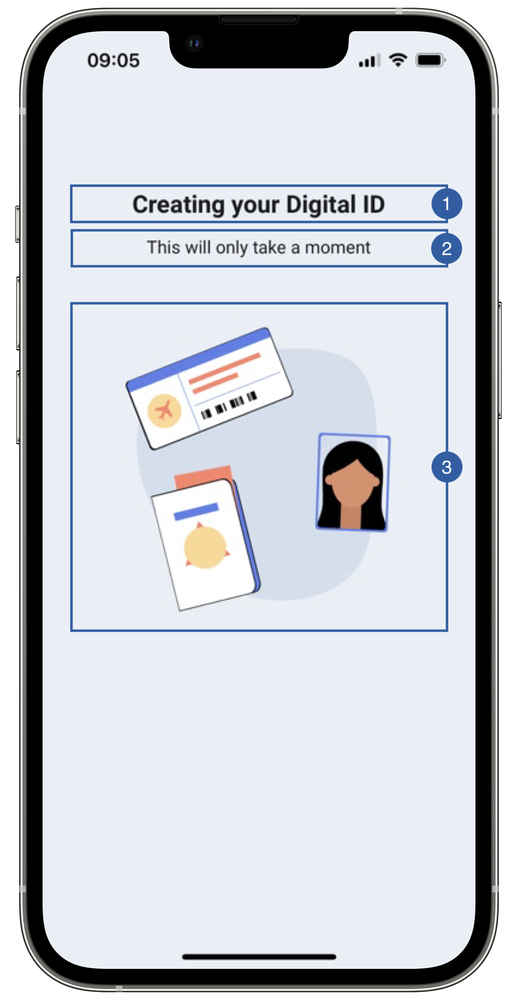

# Loading View

The only view of the Subject flow is the loading view, appears when the SDK is doing an operation on the subject and communicates it to the server

{: style="height:600px;width:300px;display: block; margin: 0 auto"}

It contains a title(1), a message(2), an image(3) and a background that can be customized.

## Branding

You can apply your own branding to our screens by overriding the resources we use.

### Text resources

=== "Android"

    You can add your own texts and localization by overriding the following string resources:
    ```xml
    <string name="subject_loading_title_sdk_enrolment">Creating your Digital ID</string>
    <string name="subject_adding_subject_sdk_enrolment">Adding subject…</string>
    <string name="subject_getting_subject_sdk_enrolment">Getting subject…</string>
    <string name="subject_updating_subject_sdk_enrolment">Updating subject…</string>
    <string name="subject_deleting_subject_sdk_enrolment">Deleting subject…</string>
    <string name="subject_adding_boarding_pass_sdk_enrolment">Adding boarding pass…</string>
    <string name="subject_deleting_boarding_pass_sdk_enrolment">Deleting boarding pass…</string>
    <string name="common_loading_message_sdk_enrolment">This will only take a moment</string>
    <string name="feature_permission_loading_message_sdk_enrolment">Please wait…</string>
    ```

=== "iOS"

    The best way to override strings is by adding your key through the Theme class
    ``` swift
    Theme.shared.strings.subject.addSubjectLoadingTitle
    Theme.shared.strings.subject.addSubjectLoadingMessage
   
    Theme.shared.strings.subject.getSubjectLoadingTitle
    Theme.shared.strings.subject.getSubjectLoadingMessage
    
    Theme.shared.strings.subject.updateSubjectLoadingTitle
    Theme.shared.strings.subject.updateSubjectLoadingMessage
    
    Theme.shared.strings.subject.deleteSubjectLoadingTitle
    Theme.shared.strings.subject.deleteSubjectLoadingMessage
    
    Theme.shared.strings.subject.addSubjectBoardingPassLoadingTitle
    Theme.shared.strings.subject.addSubjectBoardingPassLoadingMessage
    
    Theme.shared.strings.subject.deleteSubjectBoardingPassLoadingTitle
    Theme.shared.strings.subject.deleteSubjectBoardingPassLoadingMessage
    ```

    
### Colors
=== "Android"

    You can change the text colors by overriding the following color resource (It affects all texts):
    ```xml
    <color name="colorFaceCaptureTxtDarkSdkEnrolment">#1A1C1E</color>
    ```

    You can change the background color by overriding the following color resource:
    ```xml
    <color name="colorOverlayFeedbackBgSdkEnrolment">#EAEEF6</color>
    ```

=== "iOS"

    You can change the text colors by overriding the following color in Theme class (It affects all Loading Screens):
    ``` swift
    Theme.shared.colors.checkPermission.title
    Theme.shared.colors.checkPermission.subtitle
    ```
    You can change the background color by overriding the following color in Theme class(It affects all Loading Screens):
    ``` swift
    Theme.shared.colors.checkPermission.background
    ```

### Styles
=== "Android"

    You can extend the styles we use and override any properties (textColor, textSize, fontFamily, etc...) you want.
    ```xml
    <style name="Theme.Sdk.Enrolment.TextView.Dark.Title.Centered">
    <style name="Theme.Sdk.Enrolment.TextView.Dark.Subtitle.Centered">
    ```
    Note: It will affect every component that uses the same style.

=== "iOS"

    You can change the font through the theme class (this will affect all text in the app):
    ``` swift
    Theme.shared.fonts.bold
    Theme.shared.fonts.regular
    ```

### Image

=== "Android"

    You can change the loading animation by adding a raw json animation file with the following name:
    ```xml
    loading_subject_sdk_enrolment.json
    ```

=== "iOS"

    You can change the loading image by overriding the following image name in Theme class
    ``` swift
    Theme.shared.animations.subject.loadingCreate
    ```

## Use your own layouts

=== "Android"

    To use your own loading screen for subject feature, you need to implement the MobileID SDK Interface for that view.

    In this case: **ICustomSubject.LoadingView**
    ``` kotlin
    interface LoadingView {
        fun onServerCommunication()
        fun onAddingSubject()
        fun onGettingSubject()
        fun onUpdatingSubject()
        fun onDeletingSubject()
        fun onAddingBoardingPass()
        fun onDeletingBoardingPass()
        fun hideLoading()
    }
    ```
    You can use these functions to change loading screen texts, or you can opt to ignore those functions.
    
    For example create a class [SubjectLoadingCustomView](https://github.com/vbmobile/mobileid-android-sample/blob/main/customized_app/src/main/java/com/example/customized_app/presentation/subjectManagement/customViews/SubjectLoadingCustomView.kt), create a layout file and bind it.

    ```kotlin
    class SubjectLoadingCustomView (
       context: Context
    ) : LinearLayoutCompat(context), ICustomSubject.LoadingView {
    private var binding: ViewSubjectLoadingBinding
   
       init {
           binding = ViewSubjectLoadingBinding.inflate(LayoutInflater.from(context), this)
           orientation = VERTICAL
           gravity = Gravity.CENTER
       }
   
       override fun onServerCommunication() {
           // Do nothing
       }
   
       override fun onAddingSubject() {
           binding.tvSubjectLoadingTitle.text = "Adding subject"
       }
   
       override fun onGettingSubject() {
           binding.tvSubjectLoadingTitle.text = "Getting subject"
       }
   
       override fun onUpdatingSubject() {
           binding.tvSubjectLoadingTitle.text = "Updating subject"
       }
   
       override fun onDeletingSubject() {
           binding.tvSubjectLoadingTitle.text = "Deleting subject"
       }
   
       override fun onAddingBoardingPass() {
           binding.tvSubjectLoadingTitle.text = "Adding boarding pass to subject"
       }
   
       override fun onDeletingBoardingPass() {
           binding.tvSubjectLoadingTitle.text = "Removing subject's boarding pass"
       }

       override fun hideLoading() {
            // Do nothing
       }
    }
    ```

=== "iOS"

    You need to register a class of type **SubjectLoadingViewType** through the following function of **EnrolmentViewRegister**
    ``` swift
    public func registerSubjectLoadingView(_ viewType: SubjectLoadingViewType)
    ```
    
    The **SubjectLoadingOverlayViewType** class needs to respect the following protocols:
    
    ``` swift
    public protocol FeatureLoadingViewInterface {
        func onPreFeatureLoading()
        func onPostFeatureLoading()
        func hideLoading()
    }

    public typealias FeatureLoadingViewType = FeatureLoadingView.Type
    public typealias FeatureLoadingView = UIView & FeatureLoadingViewInterface

    public typealias LoadingOverlayViewType = LoadingOverlayView.Type
    public typealias LoadingOverlayView = UIView & LoadingOverlayViewInterface
    
    public protocol SubjectLoadingViewInterface: FeatureLoadingViewInterface {
        func onAddingSubject()
        func onGettingSubject()
        func onUpdatingSubject()
        func onDeletingSubjec()
        func onAddingBoardingPass()
        func onDeletingBoardingPass()
    }

    public typealias SubjectLoadingViewType = SubjectLoadingView.Type
    public typealias SubjectLoadingView = UIView & SubjectLoadingViewInterface
    ```
    
    Example:
    ``` swift
    class LoadingView: SubjectLoadingView {
    // MARK: - Initialization

        override init(frame: CGRect) {
            super.init(frame: frame)
            //add any UI customization you need
        }
        
    // MARK: - Functions

        func onPreFeatureLoading() {
            //add any UI customization you need
        }
    
        func onPostFeatureLoading() {
            //add any UI customization you need
        }
        
        func hideLoading() {
            //You can stop animations or other activities that consumes resources 
        }
        
        func onAddingSubject() {
            //add any UI customization you need
        }
    
        func onGettingSubject() {
            //add any UI customization you need
        }
    
        func onUpdatingSubject() {
            //add any UI customization you need
        }
    
        func onDeletingSubjec() {
            //add any UI customization you need
        }
    
        func onAddingBoardingPass() {
            //add any UI customization you need
        }
    
        func onDeletingBoardingPass() {
            //add any UI customization you need
        }
    }
    ```