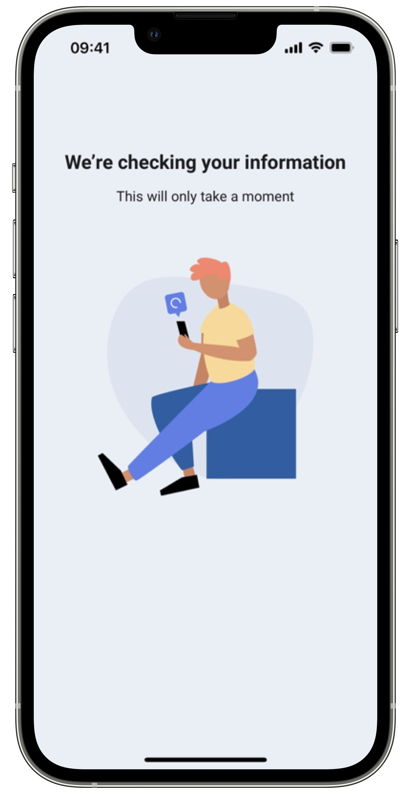

# Biometric Matching

This service allows the submission of two different biometric images, to verify that they represent
the same person. This is necessary whenever there is the need of checking if the current user is the
same person as the physical ID owner in any enrolment process. The candidate image is also submitted
to a service that performs a biometric quality check before the matching process.

## Initiate Match

You can easily provide your client app with a biometric check using our SDK’s biometric matching
functionality, available in the enrolment facade. You need to provide a BiometricMatchParameters
object that includes the reference biometrics image (for example, an official document’s photo),
against which you want to test your candidate image, also passed as a bitmap in this object. You also can include the template option if you want to get the images templates. *None* is the default. Below
is the BiometricMatchParameters structure:

=== "Android"

    ```kotlin
    data class BiometricMatchParameters(
        val candidate: Bitmap?,
        val reference: Bitmap?,
        val templateOption: TemplateOption = TemplateOption.NONE,
        val candidateHash: String?,
        val referenceHash: String?
    )
    ```
=== "iOS"

    ``` swift
    public struct BiometricMatchParameters {
        public let candidate: Data
        public let reference: Data
        public let includeTemplate: TemplateOptions
        public let candidateHash: String?
        public let referenceHash: String?
    
        public init(candidate: Data,
                reference: Data,
                includeTemplate: TemplateOptions = .none,
                candidateHash: String?,
                referenceHash: String?) 
    }
    ```

TemplateOptions is an enumeration and it contains the following cases.

=== "Android"

    ```kotlin
    enum class TemplateOption {
        NONE,
        ALL,
        CANDIDATE,
        REFERENCE
    }
    ```
    
=== "iOS"

    ``` swift
    public enum TemplateOptions: String {
        case none = "None"
        case all = "All"
        case reference = "Reference"
        case candidate = "Candidate"
    }
    ```

The `candidateHash` and `referenceHash` are the hashes provided by either the [FaceCaptureReport](../FaceCapture/FaceCapture_Index.md#face-capture-report ) and/or the [DocumentReaderReport](../DocumentReader/DocumentReader_Index.md#document-reader-report) needed to verify data integrity.

You can expect either a MatchError response or a MatchReport response. 

To start the biometric matching, you must call the following method:

=== "Android"

    ```kotlin
    /**
     * Matches two face photos to check if they're from the same person.
     *
     * Used to match the user face photo against the photo contained in the chip from the personal document.
     *
     * @param activity [Activity] that will launch the face match feature
     * @param params [BiometricMatchParameters] that contains the user photo, the photo from the document.
     * @param onMatchComplete [OnMatchCompletion] Callback to handle Match Success or Error
     */
    fun matchBiometrics(
        activity: Activity,
        params: BiometricMatchParameters,
        onMatchComplete: OnMatchCompletion,
    )
    ```

=== "iOS"

    ``` swift
    func matchBiometrics(parameters: BiometricMatchParameters, viewController: UIViewController, completionHandler: @escaping (Result<MatchReport, MatchReportError>) -> Void)
    ```
    
A successful MatchReport response means that matching analysis was successfully computed in the
server-side platform. If the candidate image (for example, a captured photo) scores above the
previously given threshold, the matched value will be true. The field matchDuration gives you
information on the request’s duration and also the templates, if they were requested.

## Handle Result

=== "Android"

    Here is how you can get the match report and handle the result for the face match:
    ```kotlin
    interface OnMatchCompletion {
        fun onMatchSuccess(matchReport: MatchReport)
        fun onMatchError(matchReportError: MatchReportError)
    }
    ```
    
    The MatchReportError has the following structure:

    ```kotlin
    data class MatchReportError(
        val userCanceled: Boolean,
        val featureError: FeatureError?
    )
    ```
    
=== "iOS"

    These method’s completion handler passes a result , where the MatchReport contains the Match information and MatchReportError contains the possible errors that may occur during the process. Below is an example of usage:

    ```swift
    self.enrolment.matchBiometrics(
        parameters: parameters,
        viewController: vco) { [weak self] result in
        switch result {
        case .success(let matchReport):
            if (matchReport.photosMatched) {
                self?.view?.onMatchSuccess()
            } else {
                self?.view?.onMatchFailed()
            }
        case .failure(let error):
            if error.userCanceled {
                print("onUserCancel")
            } else {
                print(error.featureError.publicMessage)
            }
        }
    }
    ```
    
    The MatchReportError has the following structure:
    
    ```swift
        public class MatchReportError: Error {
        public var userCanceled: Bool
        public var termsAndConditionsAccepted: Bool
        public var featureError: FeatureError
    }
    ```
    
In case of success, the MatchReport has the following structure:

=== "Android"

    ```kotlin
    data class MatchReport(
        val matchDuration: String,
        val photosMatched: Boolean,
        val algorithm: String?,
        val referenceTemplate: String?,
        val candidateTemplate: String?,
    )
    ```

=== "iOS"

    ``` swift
    public struct MatchReport: Codable {
        public let matchDuration: String
        public let photosMatched: Bool
        public let algorithm: String?
        public let referenceTemplate: Data?
        public let candidateTemplate: Data?
    }
    ```
    
## Custom Views

The SDK provides default UI solutions for the boarding pass feature flow, as 
shown in the following images:

{: style="height:600px;width:300px;display: block; margin: 0 auto"}

You can also apply your app’s colors and fonts to these layout solutions, to keep your brand’s image consistent.
Check Customization tab to learn more about branding of each view.

=== "Android"
    ```kotlin
    @Parcelize
    class BiometricFaceMatchCustomViews(
        val loadingView: Class<out ICustomBiometricFaceMatch.LoadingView>? = null
    ) : Parcelable
    ```
    You can use your own custom views in the face match functionality. Your view must implement the
    SDK view interfaces. For example, if you want to add a custom loading view, your view class must
    implement the ICustomBiometricFaceMatch.LoadingView interface.

=== "iOS"

    ``` swift
    public class EnrolmentViewRegister {
        ...
        
        // MARK: - Biometric Match
        public func registerBiometricMatchLoadingView(_ viewType: BiometricMatchLoadingViewType)
        ...
    }
    ```

    You can use your own custom views in the face match functionality. Your view must implement the
    SDK view protocols. For example, if you want to add a custom loading view, your view class must
    implement the BiometricMatchLoadingViewType interface.

In the customization tab you will also find examples to create your own custom views.
