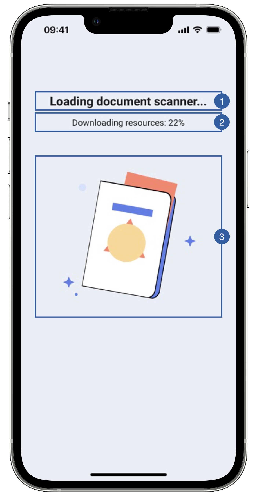

# Loading View

The first view of the document reader flow is the loading view, it appears when the feature is initializing.
In this step, if the regula database is not yet downloaded or it's outdated, the download will begin automatically.

{: style="height:600px;width:300px;display: block; margin: 0 auto"}

It contains a title(1), a message(2), an animation(3) and a background that can be customized. 

## Branding

You can apply your own branding to our screens by overriding the resources we use.

### Text resources

=== "Android"

    You can add your own texts and localization by overriding the following string resources:
    ```xml
    <string name="document_reader_loading_overlay_title_sdk_enrolment">Loading Document Reader</string>
    <string name="document_reader_initializing_overlay_message_sdk_enrolment">This may take a moment</string>
    <!-- In case the regula database needs to be downloaded we show the progress in text -->
    <string name="document_read_reader_download_progress_sdk_enrolment">Downloading resources: %d%%</string>
    <!-- When the feature is ready to start we display this message in the subtitle -->
    <string name="document_reader_loading_overlay_subtitle_sdk_enrolment">We\'ll first take a picture of your document</string>
    ```

=== "iOS"

    The best way to override strings is by adding your key through the Theme class
    
    ``` swift
    Theme.shared.strings.documentReader.initialization
    Theme.shared.strings.documentReader.initializationSubtitle
    Theme.shared.strings.documentReaderdownloadProgress
    ```

### Colors
=== "Android"

    You can change the text colors by overriding the following color resource (It affects all texts):
    ```xml
    <color name="colorFaceCaptureTxtDarkSdkEnrolment">#1A1C1E</color>
    ```

    You can change the background color by overriding the following color resource:
    ```xml
    <color name="colorOverlayFeedbackBgSdkEnrolment">#EAEEF6</color>
    ```

=== "iOS"

    You can change the text colors by overriding the following color in Theme class (It affects all Loading Screens):
    
    ``` swift
    Theme.shared.colors.checkPermission.title
    Theme.shared.colors.checkPermission.subtitle
    ```
    
    You can change the background color by overriding the following color in Theme class(It affects all Loading Screens):

    ``` swift
    Theme.shared.colors.checkPermission.background
    ```

### Styles
=== "Android"

    You can extend the styles we use and override any properties (textColor, textSize, fontFamily, etc...) you want.
    ```xml
    <style name="Theme.Sdk.Enrolment.TextView.Dark.Title.Centered">
    <style name="Theme.Sdk.Enrolment.TextView.Dark.Subtitle.Centered">
    ```
    Note: It will affect every component that uses the same style.

=== "iOS"

    You can change the font through the theme class (this will affect all text in the app):
    ``` swift
    Theme.shared.fonts.bold
    Theme.shared.fonts.regular
    ```

### Animation

=== "Android"

    You can change the loading animation by adding a raw json animation file with this name:
    ```xml
    loading_document_reader_sdk_enrolment.json
    ```

=== "iOS"

    You can change the loading animation by adding a raw json animation file and overriding the following animation name in Theme class
    ``` swift
    Theme.shared.animations.documentReader.loadingDocuments
    ```

## Use your own layouts

=== "Android"

    To use your own loading screen for document reader feature, you need to implement the MobileID SDK Interface for that view.
    
    In this case: **ICustomDocumentReader.LoadingView**
    ``` kotlin
    interface LoadingView {
        fun onPreFeatureLoading(message: String)
        fun onPostFeatureLoading()
        fun onDownloadProgressChanged(progress: Int)
        fun hideLoading()
    }
    ```
    In this screen, the loading time can deppend on the status of the database and wether it's the first feature to be called or not.
    Due to this, we have 4 methods were you can update the messages being displayed in the loading screen, or you can opt to ignore those functions.

    onPreFeatureLoading is called multiple times, with different messages that display what is happening while initializing the feature.
    onPostFeatureLoading is called when the transaction is being registered.
    onDownloadProgressChanged is called when the database download is in progress so you can share the progress with the user.
    hideLoading is called when the view is dismissed.

    For example create a class [DocumentReaderLoadingCustomView](https://github.com/vbmobile/mobileid-android-sample/blob/main/customized_app/src/main/java/com/example/customized_app/presentation/readDocument/customViews/DocumentReaderLoadingCustomView.kt), create a layout file and bind it.

    ```kotlin
    class DocumentReaderLoadingCustomView(
    context: Context
    ) : ConstraintLayout(context), ICustomDocumentReader.LoadingView {
    private var binding: ViewDocumentReaderLoadingBinding
    
        init {
            binding = ViewDocumentReaderLoadingBinding.inflate(LayoutInflater.from(context), this)
        }
    
        override fun onPreFeatureLoading(message: String) {
            binding.documentReadLoadingMessage.text = message
        }
    
        override fun onPostFeatureLoading() {
            binding.documentReadLoadingTitle.text = "Communicating"
            binding.documentReadLoadingMessage.text = ""
        }
    
        override fun onDownloadProgressChanged(progress: Int) {
            binding.documentReadLoadingMessage.text = "Progress: $progress%"
        }
    
        override fun hideLoading() {
            // Do nothing
        }
    }
    ```

=== "iOS"

    You need to register a class of type **DocumentReaderLoadingViewType** through the following function of **EnrolmentViewRegister**
    ``` swift
    public func registerDocumentReaderLoadingView(_ viewType: DocumentReaderLoadingViewType)
    ```
    
    The **DocumentReaderLoadingViewType** class needs to respect the following protocols:
    
    ``` swift
    public protocol FeatureLoadingViewInterface {
        func onPreFeatureLoading()
        func onPostFeatureLoading()
        func hideLoading()
    }

    public typealias FeatureLoadingViewType = FeatureLoadingView.Type
    public typealias FeatureLoadingView = UIView & FeatureLoadingViewInterface
  
    public protocol DocumentReaderLoadingViewInterface: FeatureLoadingView {
        func onDownloadProgressChanged(progress: Int)
        func onPreparingFeature()
    }

    public typealias DocumentReaderLoadingViewType = DocumentReaderLoadingView.Type
    public typealias DocumentReaderLoadingView = UIView & DocumentReaderLoadingViewInterface
    ```
    
    Example:
    ``` swift
    class LoadingView: DocumentReaderLoadingView {
    
        // MARK: - Initialization

        override init(frame: CGRect) {
            super.init(frame: frame)
            //add any UI customization you need
        }

        // MARK: - Functions

        func onDownloadProgressChanged(progress: Int) {
            //add any UI customization you need
        }
        
        func onPreparingFeature() {
            //add any UI customization you need
        }
        
        func onPreFeatureLoading() {
            //add any UI customization you need
        }

        func onPostFeatureLoading() {
            //add any UI customization you need
        }   

        func hideLoading() {
            //You can stop animations or other activities that consumes resources 
        }
    }
    ```