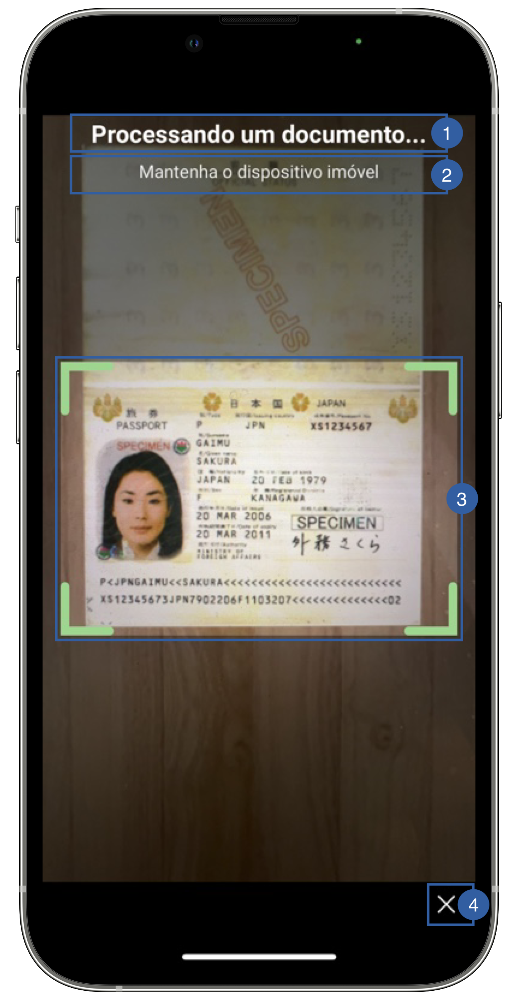

# Scan View

The second view of the document reader flow is the scan view, it's the camera screen that detects the document and reads it's data through OCR method.
This screen belongs to Regula and it does not allow us to change, only some small customization is possible.

{: style="height:600px;width:300px;display: block; margin: 0 auto"}

It contains a title(1), a message(2), a frame(3) and a cancel button (4) that can be customized.

## Branding

You can apply your own branding to our screens by overriding the resources we use.

### Text resources

This text is dynamic and has been translated into several languages

info "Supported languages:"

    - Arabic (ar)
    - Bangla (bn)
    - Czech (cs)
    - Danish (da)
    - German (de)
    - Greek (el)
    - English (en)
    - Spanish (es)
    - Finnish (fi)
    - French (fr)
    - Hebrew (he)
    - Hindi (hi)
    - Croatian (hr)
    - Hungarian (hu)
    - Indonesian (id)
    - Italian (it)
    - Japanese (ja)
    - Korean (ko)
    - Malay (ms)
    - Norwegian (nb)
    - Dutch (nl)
    - Polish (pl)
    - Portuguese (pt)
    - Romanian (ro)
    - Russian (ru)
    - Slovak (sk)
    - Swedish (sv)
    - Thai (th)
    - Turkish (tr)
    - Ukrainian (uk)
    - Vietnamese (vi)
    - Chinese Simplified (zh-Hans)
    - Chinese Traditional (zh-Hant)

If you need additional localization support that is not on this list, then you need to follow this documentation steps:
[Regula localization support](https://docs.regulaforensics.com/develop/doc-reader-sdk/mobile/customization/localization/)


### Colors
=== "Android"

    This is not customizable in Android yet

=== "iOS"

    You can change the frame color by overriding the following color in Theme class (It other screens in the app):

    ``` swift
    // Default state
    Theme.shared.colors.common.black
    // Valid state
    Theme.shared.colors.faceCapture.stateValid
    ```

### Styles
=== "Android"

    This is not customizable in Android yet

=== "iOS"

    You can change the font through the theme class (this will affect all text in the app):
    
    ``` swift
    Theme.shared.fonts.bold
    Theme.shared.fonts.regular
    ```
