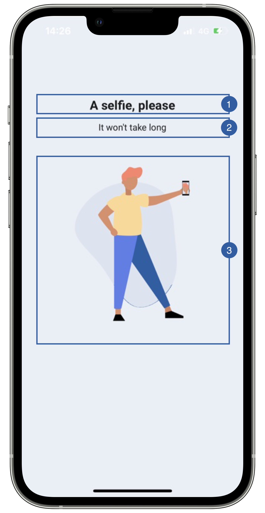

# Loading View

The only view of the biometric face capture flow is the loading view, it appears when the feature is initializing, when the selfie is being processed and when the liveness service is called.

{: style="height:600px;width:300px;display: block; margin: 0 auto"}

It contains a title(1), a message(2), an image(3) and a background that can be customized. 

## Branding

You can apply your own branding to our screens by overriding the resources we use.

### Text resources

=== "Android"

    You can add your own texts and localization by overriding the following string resources:
    ```xml
    <string name="biometric_face_capture_initializing_overlay_title_sdk_enrolment">A selfie, please</string>
    <string name="biometric_face_capture_initializing_overlay_subtitle_sdk_enrolment">Your selfie will be used to recognize you</string>
    <string name="face_capture_processing_title_sdk_enrolment">Just a moment…</string>
    <string name="face_capture_processing_subtitle_sdk_enrolment">Processing Photo</string>
    <string name="biometric_face_capture_process_photo_overlay_title_sdk_enrolment">We’re checking your picture</string>
    <string name="common_loading_message_sdk_enrolment">This will only take a moment</string>
    ```

=== "iOS"

    The best way to override strings is by adding your key through the Theme class

    ``` swift
    Theme.shared.strings.faceCapture.initialization.localized()
    Theme.shared.strings.faceCapture.processingTitle.localized()
    Theme.shared.strings.checkPermission.loadingMessage.localized()
    ```

### Colors
=== "Android"

    You can change the text colors by overriding the following color resource (It affects all texts):
    ```xml
    <color name="colorFaceCaptureTxtDarkSdkEnrolment">#1A1C1E</color>
    ```

    You can change the background color by overriding the following color resource:
    ```xml
    <color name="colorOverlayFeedbackBgSdkEnrolment">#EAEEF6</color>
    ```

=== "iOS"
    
    You can change the text colors by overriding the following color in Theme class (It affects all Loading Screens):

    ``` swift
    Theme.shared.colors.checkPermission.title
    Theme.shared.colors.checkPermission.subtitle
    ```

    You can change the background color by overriding the following color in Theme class(It affects all Loading Screens):

    ``` swift
    Theme.shared.colors.checkPermission.background
    ```
    
### Styles
=== "Android"

    You can extend the styles we use and override any properties (textColor, textSize, fontFamily, etc...) you want.
    ```xml
    <style name="Theme.Sdk.Enrolment.TextView.Dark.Title.Centered">
    <style name="Theme.Sdk.Enrolment.TextView.Dark.Subtitle.Centered">
    ```
    Note: It will affect every component that uses the same style.

=== "iOS"

    You can change the font through the theme class (this will affect all text in the app):
    
    ``` swift
    Theme.shared.fonts.bold
    Theme.shared.fonts.regular
    ```

### Image

=== "Android"

    You can change the loading animation by adding a raw json animation file with this name:
    ```xml
    loading_facecapture.json
    ```

=== "iOS"

    You can change the loading image by overriding the following image name in Theme class
    ``` swift
    Theme.shared.images.faceCapture.faceCaptureLoading
    Theme.shared.animations.common.loading
    ```

## Use your own layouts

=== "Android"

    To use your own loading screen for face capture feature, you need to implement the MobileID SDK Interface for that view.

    In this case: **ICustomBiometricFaceCapture.LoadingView**
    ``` kotlin
    interface LoadingView {
        fun onPreFeatureLoading()
        fun onFaceProcessLoading()
        fun onLivenessLoading()
        fun onPostFeatureLoading()
        fun hideLoading()
    }
    ```
    You can these functions to change loading screen texts in runtime, or you can opt to ignore those functions.
    
    For example create a class [BiometricFaceCaptureLoadingCustomView](https://github.com/vbmobile/mobileid-android-sample/blob/main/customized_app/src/main/java/com/example/customized_app/presentation/faceCapture/customViews/FaceCaptureInitCustomView.kt), create a layout file and bind it.

    ```kotlin
    class CustomFaceCaptureLoadingView @JvmOverloads constructor(
        context: Context,
        attrs: AttributeSet? = null,
        defStyleAttr: Int = 0
    ) : ConstraintLayout(context, attrs, defStyleAttr), ICustomBiometricFaceCapture.LoadingView {
    
        init {
            inflate(context, R.layout.view_biometric_face_capture_init, this)
        }
    
        override fun onPreFeatureLoading() {
        }
    
        override fun onFaceProcessLoading() {
        }
    
        override fun onLivenessLoading() {
        }
    
        override fun onPostFeatureLoading() {
        }
    
        override fun hideLoading() {
        }
    }
    ```

=== "iOS"

    You need to register a class of type **FaceCaptureLoadingViewType** through the following function of **EnrolmentViewRegister**
    ``` swift
    public func registerBiometricFaceCaptureLoadingView(_ viewType: FaceCaptureLoadingViewType)
    ```
    
    The **FaceCaptureLoadingViewType** class needs to respect the following protocols:
    
    ``` swift
    public protocol FeatureLoadingViewInterface {
        func onPreFeatureLoading()
        func onPostFeatureLoading()
        func hideLoading()
    }

    public typealias FeatureLoadingViewType = FeatureLoadingView.Type
    public typealias FeatureLoadingView = UIView & FeatureLoadingViewInterface
  
    public protocol FaceCaptureLoadingViewInterface: FeatureLoadingView {
        // called while processing is running.
        func onFaceProcessLoading()

        // called when liveness is being checked.
        func onLivenessLoading()
    }

    public typealias FaceCaptureLoadingViewType = FaceCaptureLoadingView.Type
    public typealias FaceCaptureLoadingView = UIView & FaceCaptureLoadingViewInterface
    ```
    
    Example:
    ``` swift
    class LoadingView: FaceCaptureLoadingView {
    
        // MARK: - Initialization

        override init(frame: CGRect) {
            super.init(frame: frame)
            //add any UI customization you need
        }

        // MARK: - Functions
        
        func onPreFeatureLoading() {
            //add any UI customization you need
        }

        func onPostFeatureLoading() {
            //add any UI customization you need
        }   
        
        func onFaceProcessLoading(){
            //add any UI customization you need
        }

        func onLivenessLoading(){
            //add any UI customization you need
        }

        func hideLoading() {
            //You can stop animations or other activities that consumes resources 
        }
    }
    ```


        
