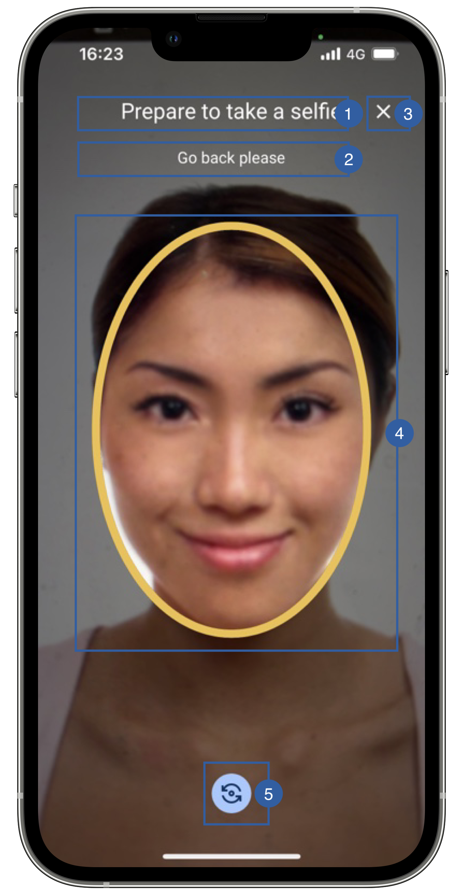

# Scan View

The camera screen is no longer a custom view in order to allow us to better control the user flow.
You can still apply any branding you want to the screen and change the frame format by using our FaceCaptureFrameFormat enum in the feature parameters.

{: style="height:600px;width:300px;display: block; margin: 0 auto"}

It contains a title(1), a message(2), a cancel button(3), a frame(4) and a rotate camera button(5).

## Branding

You can apply your own branding to our screens by overriding the resources we use.

### Text resources

=== "Android"

    You can add your own texts and localization by overriding the following string resources:
    ```xml
    <!-- Default messages-->
    <string name="face_capture_no_face_title_sdk_enrolment">Let\'s frame your face…</string>
    <string name="face_capture_no_face_subtitle_sdk_enrolment">Stand still, please</string>
    
    <!-- Possible title messages-->
    <string name="face_capture_processing_title_sdk_enrolment">Just a moment…</string>
    <string name="face_capture_mouth_open_title_sdk_enrolment">Prepare to take a selfie</string>
    <string name="face_capture_invalid_rotation_title_sdk_enrolment">Prepare to take a selfie</string>
    <string name="face_capture_invalid_verticalness_title_sdk_enrolment">Prepare to take a selfie</string>
    <string name="face_capture_too_far_title_sdk_enrolment">Prepare to take a selfie</string>
    <string name="face_capture_too_close_title_sdk_enrolment">Prepare to take a selfie</string>
    <string name="face_capture_not_centered_title_sdk_enrolment">Prepare to take a selfie</string>
    <string name="face_capture_multiple_faces_detected_title_sdk_enrolment">Prepare to take a selfie</string>
    <string name="face_capture_no_face_title_sdk_enrolment">Let\'s frame your face…</string>
    <string name="face_capture_eyes_closed_title_sdk_enrolment">Prepare to take a selfie</string>
    <string name="face_capture_smiling_title_sdk_enrolment">Prepare to take a selfie</string>
    <string name="face_capture_face_sideways_title_sdk_enrolment">Prepare to take a selfie</string>

    <!-- Possible subtitle messages-->
    <string name="face_capture_processing_subtitle_sdk_enrolment">Processing Photo</string>
    <string name="face_capture_mouth_open_subtitle_sdk_enrolment">Close your mouth</string>
    <string name="face_capture_invalid_rotation_subtitle_sdk_enrolment">Straighten your head</string>
    <string name="face_capture_invalid_verticalness_subtitle_sdk_enrolment">Don\'t look up/down</string>
    <string name="face_capture_too_far_subtitle_sdk_enrolment">Approximate please</string>
    <string name="face_capture_too_close_subtitle_sdk_enrolment">Go back please</string>
    <string name="face_capture_not_centered_subtitle_sdk_enrolment">Center your head</string>
    <string name="face_capture_multiple_faces_detected_subtitle_sdk_enrolment">Multiple faces detected</string>
    <string name="face_capture_ready_subtitle_sdk_enrolment">One moment, please</string>
    <string name="face_capture_eyes_closed_subtitle_sdk_enrolment">Open your eyes please</string>
    <string name="face_capture_smiling_subtitle_sdk_enrolment">Keep a straight face</string>
    <string name="face_capture_face_sideways_subtitle_sdk_enrolment">Look to the camera</string>
    ```

=== "iOS"

    The best way to override strings is by adding your key through the Theme class  
    
    ``` swift
    //Possible title messages
    Theme.shared.strings.faceCapture.titleNoFace.localized()
    Theme.shared.strings.faceCapture.titleCountDown.localized()
    Theme.shared.strings.faceCapture.titleDone.localized()
    Theme.shared.strings.faceCapture.title.localized()

    
    //Possible subtitle messages
    Theme.shared.strings.faceCapture.info.localized()
    Theme.shared.strings.faceCapture.infoCountDown.localized()
    Theme.shared.strings.faceCapture.noFaceDetected.localized()
    Theme.shared.strings.faceCapture.turnedHead.localized()
    Theme.shared.strings.faceCapture.closedEyes.localized()
    Theme.shared.strings.faceCapture.smiling.localized()
    Theme.shared.strings.faceCapture.openMouth.localized()
    Theme.shared.strings.faceCapture.headOffCenter.localized()
    Theme.shared.strings.faceCapture.tooClose.localized()
    Theme.shared.strings.faceCapture.tooFar.localized()
    Theme.shared.strings.faceCapture.ready.localized()
    Theme.shared.strings.faceCapture.multipleFaces.localized()
    Theme.shared.strings.faceCapture.darkGlasses.localized()
    Theme.shared.strings.faceCapture.lowFaceQuality.localized()
    Theme.shared.strings.faceCapture.imageBlurredError.localized()
    ```

### Colors
=== "Android"

    You can change the text colors by overriding the following color resource (It affects all texts):
    ```xml
    <color name="colorFaceCaptureTxtLightSdkEnrolment">#DFFFFFFF</color>

    <!-- Rotate camera button -->
    <color name="colorFaceCaptureButtonStrokeSdkEnrolment">#FFFFFF</color>
    <color name="colorFaceCaptureButtonBgSdkEnrolment">#CFD8DC</color>
    ```

=== "iOS"

    You can change the text colors by overriding the following color in Theme class
    ``` swift
    Theme.shared.colors.faceCapture.title
    Theme.shared.colors.faceCapture.stateLabel
    ```
    
    You can change the frame colors by overriding the following color in Theme class
    ``` swift
    Theme.shared.colors.common.black
    Theme.shared.colors.faceCapture.stateError
    Theme.shared.colors.faceCapture.stateValid
    ```
    
    You can change the mask and flash colors by overriding the following color in Theme class
    ``` swift                            
    Theme.shared.colors.component.transparentOverlay
    Theme.shared.colors.faceCapture.flash
    ```
    
    You can change the rotate camera button colors by overriding the following color in Theme class
    ``` swift                                                    
    Theme.shared.colors.faceCapture.cameraSwitchButtonImageTint
    Theme.shared.colors.faceCapture.cameraSwitchButtonBackground
    ```

### Styles
=== "Android"

    You can extend the styles we use and override any properties (textColor, textSize, fontFamily, etc...) you want.
    ```xml
    <style name="Theme.Sdk.Enrolment.TextView.Light.Title.Centered">
    <style name="Theme.Sdk.Enrolment.TextView.Light.Subtitle.Centered">
    <style name="Theme.Sdk.Enrolment.ButtonCancel">
    <style name="Theme.Sdk.Enrolment.Face.Capture.Button">
    ```
    Note: It will affect every component that uses the same style.

=== "iOS"

    You can change the font through the theme class (this will affect all text in the app):
    
    ``` swift
    Theme.shared.fonts.regular
    ```

### Image

=== "Android"

    You can change the icon of the rotate camera button by adding a drawable with this name:
    ```xml
    ic_flip_camera.xml
    ```
    The image we are using is 48x48dp.

    You can change the icon of the cancel button by adding a drawable with this name:
    ```xml
    ic_cancel_sdk_enrolment.xml
    ```
    The image we are using is 24x24dp.

=== "iOS"

    You can change the icon of the cancel button by overriding the following image in Theme class
    ``` swift
    Theme.shared.images.buttons.closeButton
    ```

    You can change the icon of the rotate camera button by overriding the following image in Theme class
    ``` swift
    Theme.shared.images.faceCapture.toggleCameraButton
    ```
