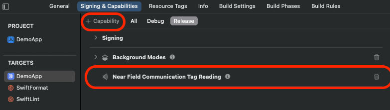
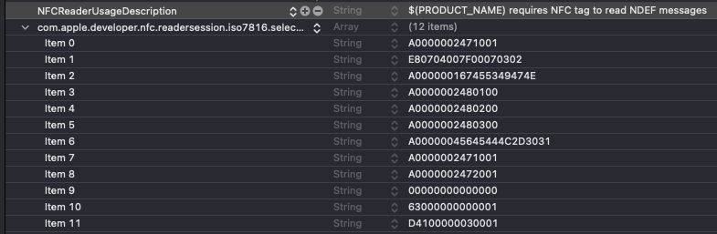
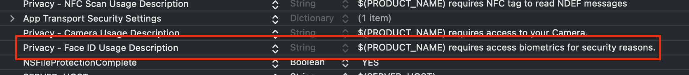
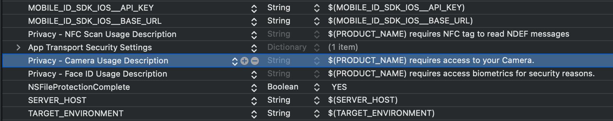
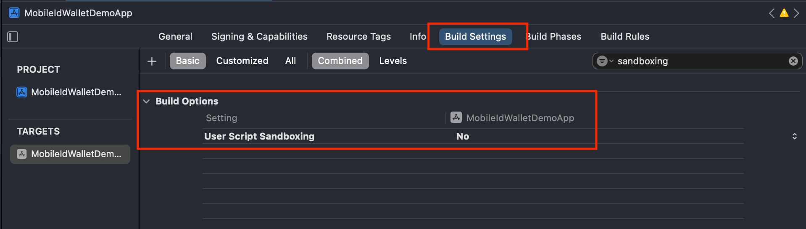

---
hide:
  - navigation
---

# Getting started

## Introduction

The Mobile ID Wallet SDK provides a comprehensive set of tools to manage digital identity documents and boarding passes securely within an app. It allows developers to capture and parse documents and boarding passes using the device camera, optionally leveraging RFID for added security. Parsed information will be stored in the wallet, retrieved for display, or deleted as needed. 

### Key Features

* __Setup & Configuration:__ Initialize and configure the wallet with custom setup parameters.
* __Document & Boarding Pass Management:__ Parse Boarding Pass: Extract flight details from an image.
Scan Boarding Pass: Capture and parse boarding passes using the device camera.
Read Document: Scan identity documents via camera and RFID.
* __Data Retrieval & Storage:__ Retrieve all stored documents or boarding passes.
Fetch specific items by unique identifiers.
Access full details of original boarding passes.
* __Deletion Operations:__ Delete individual documents or boarding passes.
Perform batch deletion of all wallet content.
* __Association & Linking:__ Associate boarding passes with identity documents and create subject relationships.
* __Status Tracking:__ Query the current status of a subject by ID.

{: style="display: block; margin: 5px auto"}

## Prerequisites

You must send an ID (Bundle ID or Application ID) to Amadeus so that we can associate the API key with the application, this way your API key is protected with only authorized applications.

=== "Android"

    To integrate the **Mobile ID Wallet SDK** for Android, the following prerequisites must be met: 

    - Install Android Studio
    - Target API level 26 (Oreo) or later

    You must also send an ID (Bundle ID or Application ID) to Amadeus so that we can associate the API key with the application, this way your API key is protected with only authorized applications.

=== "iOS"

    To integrate the **Mobile ID Wallet SDK** for iOS, the following prerequisites must be met: 
    
    - Install or update Xcode to latest version;
    - Target iOS 14 or later. 
    - Install CocoaPods

## SDK install

=== "Android"

    To add the Wallet SDK to your app, perform the following steps:

    1. Add these new repositories in your app top level gradle file:
    ```
    maven { url "https://vbmobileidstorage.blob.core.windows.net/android/" }
    maven { url "https://maven.regulaforensics.com/RegulaDocumentReader" }
    maven { url "https://jitpack.io" }
    ```
    2. Declare Mobile ID SDK and document reader provider as a dependency in your app level gradle file:
    ```
    implementation("com.amadeus.wallet.sdk:mobileid-wallet-sdk:1.0.0@aar") { transitive = true }

    ```
    3. Sync gradle.

=== "iOS"

    To add the SDK to your app, perform the following steps:
    
    **CocoaPods**
    
    To always use the latest release, add the following to your Podfile:
    
    1. Add the following to your Podfile, with the latest version:
    ```
    pod 'mobileid-wallet-sdk', '1.0.0'
    ```
    2. Add cocoapods repo as a source in your podfile:
    ```
    source 'https://cdn.cocoapods.org/'
    ```
    3. Run in Terminal the command below to install pods in your project:
    ```
    pod install
    ```

    **NOTE:** Due the necessity of the SDK to be built for distribution, a post installscript might be needed in your Podfile: (https://github.com/CocoaPods/CocoaPods/issues/9232).
    Example:
    ```
	 post_install do |pi|
	     pi.pods_project.targets.each do |t|
	         t.build_configurations.each do |config|
	             config.build_settings['ONLY_ACTIVE_ARCH'] = 'NO'
	             config.build_settings['BUILD_LIBRARY_FOR_DISTRIBUTION'] = 'YES'
	         end
	     end
	 end
    ```
    
	finally a full pod file will look something like:
    
    ```
	source 'https://cdn.cocoapods.org/'
	
	platform :ios, '15.0'
	use_modular_headers!  
	
	workspace 'Workspace.xcworkspace'
	project 'DemoApp.xcodeproj'
	
	target 'DemoApp' do
	  use_frameworks!
	  project 'DemoApp.xcodeproj'
	  pod 'mobileid-wallet-sdk', '1.0.0'
	end
	
	post_install do |pi|
	    pi.pods_project.targets.each do |t|
	        t.build_configurations.each do |config|
	            config.build_settings['ONLY_ACTIVE_ARCH'] = 'NO'
	            config.build_settings['BUILD_LIBRARY_FOR_DISTRIBUTION'] = 'YES'
	        end
	    end
	end
	```    
    
## Configurations

### MobileIdWalletConfig, WalletCoreConfig

- _apiKey_: apiKey from Mobile API server;
- _baseURL_: baseURL from Mobile API server;
- _databaseID_: databaseID from Mobile API server;

=== "Android"

    ```kotlin
    WalletSdkConfig(
        enrolmentConfig = EnrolmentConfig(
            documentReaderConfig = DocumentReaderConfig(
                multipageProcessing = true,
                databaseId = "<YOUR_DATABASE_ID>"
            ),
            apiConfig = APIConfig(
                baseUrl = URL("<YOUR_ENROLMENT_BASE_URL>"),
                timeout = 30,
                logLevel = MobileAPILogLevel.NONE,
                apiKey = "<YOUR_API_KEY>"
            )
        ),
        enrolmentCustomViews = EnrolmentCustomViews(
            ...
        )
        walletConfig = WalletConfig(
            logLevel = WalletLogLevel.NONE
        )
    )
    ```

=== "iOS"

    ```swift
        let mobileIdWalletConfig: MobileIdWalletConfig = .init(
            enrolmentConfig: .init(apiConfig:
                .init(
                    baseURL: "<YOUR_WALLET_SERVER_HOST_BASE_URL>",
                    timeout: 30,
                    apiKey: "<YOUR_API_KEY>"
                )
            ),
            documentReaderConfig: .init(
                multipageProcessing: false,
                databaseID: "<YOUR_DATABASE_ID>"
            ),
            enrolmentViewRegister: .init()
        )
    ```
    
## Initialize the SDK

For more customization and flexibility, this option allows developers to implement their own UI and define the logic for various features. It requires additional development effort but enables a fully tailored user experience.

Choose the option that best fits your project’s requirements!

=== "Android"

    We advise to initialize the sdk on the application level:

    ```kotlin
    val walletSdkConfig = WalletSdkConfig(
        ...
    ) 
    MobileIdWallet.initialize(
        context = this,
        walletConfig = walletSdkConfig,
        onEnrolmentInitialized = { success, error ->
            if (!success) {
                print(error)
            }
        }
    )
    ```

=== "iOS"
	
    ```swift
	import UIKit
	import MobileIdSDKiOS
	import MobileIdWalletSDK
	
	extension AppDelegate {
	    func application(_ application: UIApplication, didFinishLaunchingWithOptions launchOptions: [UIApplication.LaunchOptionsKey: Any]?) -> Bool {
	        window = UIWindow(frame: UIScreen.main.bounds)
	        //
	        // Prepare SDK Config
	        //
	        let mobileIdWalletConfig: MobileIdWalletConfig = .init(
	            enrolmentConfig: .init(apiConfig:
	                .init(
	                    baseURL: "<YOUR_ENROLMENT_BASE_URL>",
	                    timeout: 30,
	                    apiKey: "<YOUR_API_KEY>"
	                )
	            ),
	            documentReaderConfig: .init(
	                multipageProcessing: false,
	                databaseID: "<YOUR_DATABASE_ID>"
	            ),
	            enrolmentViewRegister: .init()
	        )
	        let mobileIdWalletSetup: MobileIdWalletSetup.Input = .init(
	            mobileIdWalletConfig: mobileIdWalletConfig
	        )
	        //
	        // Create SDK Instances & Setup
	        //
	        let mobileIdWallet: MobileIdWalletProtocol = MobileIdWallet.shared
	        mobileIdWallet.setup(mobileIdWalletSetup)
	
	        //
	        // WelcomeScreenViewController is your app inititial screen
	        //
	        window?.rootViewController = UINavigationController(rootViewController: WelcomeScreenViewController(dependencies: nil))
	        window?.makeKeyAndVisible()
	
	        return true
	    }
	}
    ```    


## Permissions

### RFID Chip Processing

=== "Android"

    In order to use the RFID feature, the user must give the NFC permission in runtime, otherwise it won't work. We already handle the permission check and added to the manifest the following:
    ```xml
    <uses-permission android:name="android.permission.NFC" />
    ```
    So when using the RFID feature, the user will be prompted to concede the permission if it hadn't already.

    
=== "iOS"
            
    __Step 1:__ Add Near Field Communication Tag Reading under the Capabilities tab for the project’s target (or on your .entitlements file):
    
    ``` html
    <key>com.apple.developer.nfc.readersession.formats</key>
	<array>
	    <string>TAG</string>
	</array>
	```
    
    {: style="display: block; margin: 5px auto"}
    
    __Step 2:__  Add the NFCReaderUsageDescription permission to your Info.plist file as its needed to access the NFC hardware:
    
    ``` html
    <key>NFCReaderUsageDescription</key>
    <string>NFC tag to read NDEF messages</string>
    ```
    
    __Step 3:__ Declare `com.apple.developer.nfc.readersession.iso7816.select-identifiers` a list of application identifiers that the app
    must be able to read according to ISO7816:
    
    ``` html
    <key>com.apple.developer.nfc.readersession.iso7816.select-identifiers</key>
    <array>
		<string>A0000002471001</string>
		<string>E80704007F00070302</string>
		<string>A000000167455349474E</string>
		<string>A0000002480100</string>
		<string>A0000002480200</string>
		<string>A0000002480300</string>
		<string>A00000045645444C2D3031</string>
		<string>A0000002471001</string>
		<string>A0000002472001</string>
		<string>00000000000000</string>
		<string>63000000000001</string>
		<string>D4100000030001</string>
    </array>
    ```

    {: style="display: block; margin: 5px auto"}

### FaceID
In order for the SDK to use the FaceID, the user must grant permission to do so.

=== "Android"

    Nothing to do.
    
=== "iOS"
    
    To configure, in the app's __Info.plist__ file, include __NSFaceIDUsageDescription__.
    After includ it, provide a description of why the app requires Face ID authentication.
    
    {: style="display: block; margin: 5px auto"}
    
    
### Camera

In order for the SDK to use the camera, the user must grant permission to do so.

=== "Android"

    In order to use the camera related features, the user must give the camera permission in runtime, otherwise it won't work. We already handle the permission check and added to the manifest the following:
    ```xml
    <uses-permission android:name="android.permission.CAMERA" />
    ```
    So when using any feature that needs the camera, the user will be prompted to concede the permission if it hadn't already.

=== "iOS"

    To configure, in the app's __Info.plist__ file, include __NSCameraUsageDescription__.
    After includ it, provide a message that explains the user why your app needs to capture media.
    
    {: style="display: block; margin: 5px auto"}


## Dependencies

=== "Android"

    - Amadeus Enrolment
        - com.visionbox.mobileid.sdk:mid-sdk-enrolment:8.1.0
        - com.visionbox.mobileid.sdk:vb-ocrmrzrfid-regula:1.0.3
        
=== "iOS"

    - 'MobileIdSDKiOS', '~> '8.1.6'
    - 'WalletLibrary', 
    - 'VBOcrMrzRfidRegula-ios'     


## Other Settings

=== "Android"

    Nothing to do.
        
=== "iOS"

	Disable User Script Sandboxing by pasting 
	
	```
	ENABLE_USER_SCRIPT_SANDBOXING = NO
	``` 
	
	on project settings.

    {: style="display: block; margin: 5px auto"}