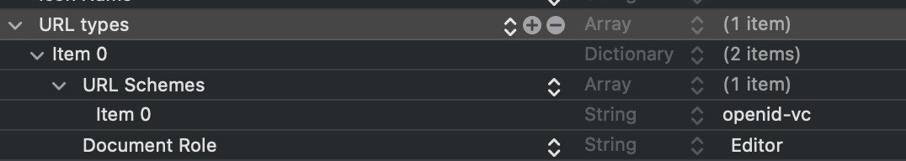

---
hide:
  - navigation
---

# Getting started

## Overall arquicteture

__MobileIdWalletSDK__ vs. __MobileIdWalletUISDK__

This SDK is designed to offer both flexibility and ease of use, with two distinct modules to fit different integration needs:

* __MobileIdWalletSDK__ – The core SDK, providing all essential features for managing verifiable credentials and boarding passes. Ideal for developers who want full control over UI design and implementation.

* __MobileIdWalletUISDK__ – A higher-level module that includes a prebuilt UI, making it easier to integrate and manage credentials and boarding passes with minimal effort. This is perfect for those who want a faster implementation without designing custom interfaces.
Whether you need a custom experience or a ready-to-use solution, the SDK adapts to your needs while ensuring a smooth and efficient workflow.

{: style="display: block; margin: 5px auto"}


## Prerequisites

You must send an ID (Bundle ID or Application ID) to Amadeus so that we can associate the API key with the application, this way your API key is protected with only authorized applications.

=== "Android"

    To integrate the **Mobile ID Wallet SDK** for Android, the following prerequisites must be met: 

    - Install Android Studio
    - Target API level 26 (Oreo) or later

    You must also send an ID (Bundle ID or Application ID) to Amadeus so that we can associate the API key with the application, this way your API key is protected with only authorized applications.

=== "iOS"

    To integrate the **Mobile ID Wallet SDK** for iOS, the following prerequisites must be met: 
    
    - Install or update Xcode to latest version;
    - Target iOS 14 or later. 
    - Install CocoaPods

## SDK install

=== "Android"

    To add the Wallet SDK to your app, perform the following steps:

    1. Add these new repositories in your app top level gradle file:
    ```
    maven { url "https://vbmobileidstorage.blob.core.windows.net/android/" }
    maven { url "https://maven.regulaforensics.com/RegulaDocumentReader" }
    maven { url "https://jitpack.io" }
    ```
    2. Declare Mobile ID SDK and document reader provider as a dependency in your app level gradle file:
    ```
    implementation("com.amadeus.wallet.sdk:mobileid-wallet-sdk:<1.0.0-beta.1>@aar") { transitive = true }

    ```
    3. Sync gradle.

=== "iOS"

    To add the SDK to your app, perform the following steps:
    
    **CocoaPods**
    
    To always use the latest release, add the following to your Podfile:
    
    1. Add the following to your Podfile, with the latest version:
    ```
    pod 'mobileid-wallet-sdk', '1.0.0-beta.1'
    ```
    2. Add MobileIdWalletSDK cocoapods repo as a source in your podfile:
    ```
    source ‘https://cdn.cocoapods.org/
    ```
    3. Run in Terminal the command below to install pods in your project:
    ```
    pod install
    ```

    **NOTE:** Due the necessity of the SDK to be built for distribution, a post installscript might be needed in your Podfile: (https://github.com/CocoaPods/CocoaPods/issues/9232).
    Example:
    ```
    post_install do |installer|
        installer.pods_project.build_configurations.each do |config|
            config.build_settings['BUILD_LIBRARY_FOR_DISTRIBUTION'] = 'YES'
            config.build_settings["EXCLUDED_ARCHS[sdk=iphonesimulator*]"] = "arm64"
        end
    end
    ```
    
    
	finally a full pod file will look like:
    
    ```
	source 'https://github.com/CocoaPods/Specs.git'
	
	platform :ios, '15.0'
	use_modular_headers!  
	
	project 'MobileIdWalletDemoApp.xcodeproj'
	workspace 'Workspace.xcworkspace'
	
	target 'MobileIdWalletDemoApp' do
	  use_frameworks!
	  project 'MobileIdWalletDemoApp.xcodeproj'
	  pod "WalletLibrary"
	  pod "lottie-ios"
	  pod 'mobileid-wallet-sdk', '1.0.0-beta.1'
	  pod 'mobileid-wallet-ui-sdk', '1.0.0-beta.1'
	end
	
	post_install do |installer|
	  installer.pods_project.build_configurations.each do |config|
	    config.build_settings['BUILD_LIBRARY_FOR_DISTRIBUTION'] = 'YES'
	  end
	end
	```    
    
## Configurations

### MobileIdWalletConfig, WalletCoreConfig

- _serverHost_: serverHost from Mobile Wallet API server;
- _apiKey_: apiKey from Mobile API server;
- _baseURL_: baseURL from Mobile API server;
- _databaseID_: databaseID from Mobile API server;

=== "Android"

    ```kotlin
    WalletSdkConfig(
        enrolmentConfig = EnrolmentConfig(
            documentReaderConfig = DocumentReaderConfig(
                multipageProcessing = true,
                databaseId = "Full"
            ),
            apiConfig = APIConfig(
                baseUrl = URL("<YOUR_ENROLMENT_BASE_URL>"),
                timeout = 30,
                logLevel = MobileAPILogLevel.NONE,
                apiKey = "<YOUR_API_KEY>"
            )
        ),
        walletConfig = WalletConfig(
            url = URL("<YOUR_WALLET_SERVER_HOST_BASE_URL>"),
            logLevel = WalletLogLevel.NONE
        )
    )
    ```

=== "iOS"

    ```swift
        let walletCoreConfig: WalletCoreConfig = .init(serverHost: ConfigValues.WalletSDKCore.serverHost)
        let mobileIdWalletConfig: MobileIdWalletConfig = .init(
            apiKey:ConfigValues.MobileIdSDK.apiKey,
            baseURL:ConfigValues.MobileIdSDK.baseURL,
            databaseID: ConfigValues.MobileIdSDK.databaseID,
            walletCoreConfig: walletCoreConfig
        )
    ```
    
## Initialize the SDK

When integrating the Mobile ID Wallet SDK, you have two options depending on your needs:

__Option 1 - MobileIdWalletUI__: This option provides a pre-built UI that is ready to use out of the box. It simplifies integration and allows developers to quickly implement Mobile ID functionality without worrying about designing the user interface.

__Option 2 - MobileIdWalletSDK__: For more customization and flexibility, this option allows developers to implement their own UI and define the logic for various features. It requires additional development effort but enables a fully tailored user experience.

Choose the option that best fits your project’s requirements!

=== "Android"

    We advise to initialize the sdk on the application level:

    __Option 1 - Using MobileIdWalletUISDK__
    ```kotlin
    MobileIdWalletUI.initialize(
        context = this,
        documentReaderParameters = DocumentReaderParameters(true),
        boardingPassScanParameters = BoardingPassParameters(false),
        config = MobileIdWalletUIConfig(
            documentReaderConfig = DocumentReaderConfig(
                multipageProcessing = true,
                databaseId = "Full"
            ),
            apiConfig = APIConfig(
                baseUrl = URL("<YOUR_ENROLMENT_BASE_URL>"),
                timeout = 30,
                logLevel = MobileAPILogLevel.NONE,
                apiKey = "<YOUR_API_KEY>"
            ),
            walletUIConfig = WalletUIConfig(
                url = URL("<YOUR_WALLET_SERVER_HOST_BASE_URL>"),
                logLevel = WalletUILogLevel.NONE
            )
        )
    )
    ```

    __Option 2 - Using MobileIdWalletSDK__

    ```kotlin
    MobileIdWallet.initialize(
        context = this,
        walletConfig = WalletSdkConfig(
            enrolmentConfig = EnrolmentConfig(
                documentReaderConfig = DocumentReaderConfig(
                    multipageProcessing = true,
                    databaseId = "Full"
                ),
                apiConfig = APIConfig(
                    baseUrl = URL("<YOUR_ENROLMENT_BASE_URL>"),
                    timeout = 30,
                    logLevel = MobileAPILogLevel.NONE,
                    apiKey = "<YOUR_API_KEY>"
                )
            ),
            walletConfig = WalletConfig(
                url = URL("<YOUR_WALLET_SERVER_HOST_BASE_URL>"),
                logLevel = WalletLogLevel.NONE
            )
        )
    )
    ```

=== "iOS"

	__Option 1 - Using MobileIdWalletUI__
	
    ```swift
    import UIKit
    import MobileIdWalletUISDK
    import MobileIdWalletSDK

    func applicationMobileIdWalletUIProtocol(_ application: UIApplication, didFinishLaunchingWithOptions launchOptions: [UIApplication.LaunchOptionsKey: Any]?) -> Bool {
        window = UIWindow(frame: UIScreen.main.bounds)
        //
        // Prepare SDK Config
        //
        let mobileIdWalletConfig: MobileIdWalletConfig = .init(
            apiKey: ConfigValues.MobileIdSDK.apiKey,
            baseURL: ConfigValues.MobileIdSDK.baseURL,
            databaseID: ConfigValues.MobileIdSDK.databaseID,
            serverHost: ConfigValues.WalletSDKCore.serverHost
        )
        //
        // Create SDK Instances & Setup SDK
        //
        let mobileIdWalletUI: MobileIdWalletUIProtocol = MobileIdWalletUI.shared
        let mobileIdWallet: MobileIdWalletProtocol = MobileIdWallet.shared
        mobileIdWalletUI.setup(.init(
            mobileIdWallet: mobileIdWallet,
            mobileIdWalletSetup: .init(
                mobileIdWalletConfig: mobileIdWalletConfig
            )
        ))

        //
        // Inject MobileIdWalletUIRouterProtocol router in your initial screen
        // More info at documentation website at Features/MobileIdWalletUISDK/Intro
        let walletUIRouter: MobileIdWalletUIRouterProtocol = MobileIdWalletUIRouter()
        let initialViewController = MobileIdWalletUISDKSampleViewController(router: walletUIRouter)
        window?.rootViewController = UINavigationController(rootViewController: initialViewController)
        window?.makeKeyAndVisible()
        if let rootViewController = window?.rootViewController {
            walletUIRouter.setup(rootViewController: rootViewController)
        }
        return true
    }
    ```

    __Option 2 - Using MobileIdWalletSDK__
	
    ```swift
    import MobileIdWalletUISDK
    import MobileIdWalletSDK
    
    func applicationMobileIdWalletProtocol(_ application: UIApplication, didFinishLaunchingWithOptions launchOptions: [UIApplication.LaunchOptionsKey: Any]?) -> Bool {
        window = UIWindow(frame: UIScreen.main.bounds)
        //
        // Prepare SDK Config
        //
        let mobileIdWalletConfig: MobileIdWalletConfig = .init(
            apiKey: ConfigValues.MobileIdSDK.apiKey,
            baseURL: ConfigValues.MobileIdSDK.baseURL,
            databaseID: ConfigValues.MobileIdSDK.databaseID,
            serverHost: ConfigValues.WalletSDKCore.serverHost
        )
        let mobileIdWalletSetup: MobileIdWalletSetup.Input = .init(
            mobileIdWalletConfig: mobileIdWalletConfig
        )
        //
        // Create SDK Instances & Setup
        //
        let mobileIdWallet: MobileIdWalletProtocol = MobileIdWallet.shared
        mobileIdWallet.setup(mobileIdWalletSetup)
        
        //
        // WelcomeScreenViewController is your app inititial screen
        //
        window?.rootViewController = UINavigationController(rootViewController: WelcomeScreenViewController(dependencies: nil))
        window?.makeKeyAndVisible()

        return true
    }
    ```    


## Permissions

### RFID Chip Processing

=== "Android"

    In order to use the RFID feature, the user must give the NFC permission in runtime, otherwise it won't work. We already handle the permission check and added to the manifest the following:
    ```xml
    <uses-permission android:name="android.permission.NFC" />
    ```
    So when using the RFID feature, the user will be prompted to concede the permission if it hadn't already.

    
=== "iOS"
            
    __Step 1:__ Add Near Field Communication Tag Reading under the Capabilities tab for the project’s target (or on your .entitlements file):
    
    ``` html
    <key>com.apple.developer.nfc.readersession.formats</key>
	<array>
	    <string>TAG</string>
	</array>
	```
    
    {: style="display: block; margin: 5px auto"}
    
    __Step 2:__  Add the NFCReaderUsageDescription permission to your Info.plist file as its needed to access the NFC hardware:
    
    ``` html
    <key>NFCReaderUsageDescription</key>
    <string>NFC tag to read NDEF messages</string>
    ```
    
    __Step 3:__ Declare `com.apple.developer.nfc.readersession.iso7816.select-identifiers` a list of application identifiers that the app
    must be able to read according to ISO7816:
    
    ``` html
    <key>com.apple.developer.nfc.readersession.iso7816.select-identifiers</key>
    <array>
		<string>A0000002471001</string>
		<string>E80704007F00070302</string>
		<string>A000000167455349474E</string>
		<string>A0000002480100</string>
		<string>A0000002480200</string>
		<string>A0000002480300</string>
		<string>A00000045645444C2D3031</string>
		<string>A0000002471001</string>
		<string>A0000002472001</string>
		<string>00000000000000</string>
		<string>63000000000001</string>
		<string>D4100000030001</string>
    </array>
    ```

    {: style="display: block; margin: 5px auto"}

### Deep Links
In order for the SDK to use the deep links, the user must grant permission to do so.


=== "Android"

    In order to handle the deeplinks to share the credential, if you use the **MobileIdWalletUISDK** you don't need to do anything. The UI SDK already handles the deeplink.

    If you are using the **MobileIdWalletSDK** you need to handle the deeplink. In the Manifest add the following intent-filter to your activity:

    ```xml
    <intent-filter >
        <action android:name="android.intent.action.VIEW" />
        <category android:name="android.intent.category.DEFAULT" />
        <category android:name="android.intent.category.BROWSABLE" />

        <data android:scheme="openid-vc" />
    </intent-filter>
    ```

    And in your activity:
    ```kotlin
    MobileIdWallet.getInstance().sharePassportCredential(
        input = SharePassportCredential.Input(
            url = intent.data,
            verifiedCredentialId = digitalId,
            requiresAuthenticationToCompleteFlow = true
        )
    )
    ```
    
    The digital id, should be the id of the credential that the user wants to share.
    
=== "iOS"
    
    To configure, in the app's __Info.plist__ file, include __ CFBundleURLTypes__.
    
    ```
	<key>CFBundleURLTypes</key>
	<array>
		<dict>
			<key>CFBundleURLSchemes</key>
			<array>
				<string>openid-vc</string>
			</array>
			<key>CFBundleTypeRole</key>
			<string>Editor</string>
		</dict>
	</array>
	```
	    
    {: style="display: block; margin: 5px auto"}

### FaceID
In order for the SDK to use the FaceID, the user must grant permission to do so.


=== "Android"

    Nothing to do.
    
    
=== "iOS"
    
    To configure, in the app's __Info.plist__ file, include __NSFaceIDUsageDescription__.
    After includ it, provide a description of why the app requires Face ID authentication.
    
    {: style="display: block; margin: 5px auto"}
    
    
### Camera

In order for the SDK to use the camera, the user must grant permission to do so.

=== "Android"

    In order to use the camera related features, the user must give the camera permission in runtime, otherwise it won't work. We already handle the permission check and added to the manifest the following:
    ```xml
    <uses-permission android:name="android.permission.CAMERA" />
    ```
    So when using any feature that needs the camera, the user will be prompted to concede the permission if it hadn't already.

=== "iOS"

    To configure, in the app's __Info.plist__ file, include __NSCameraUsageDescription__.
    After includ it, provide a message that explains the user why your app needs to capture media.
    
    {: style="display: block; margin: 5px auto"}


## Dependencies

=== "Android"

    - Microsoft
        - com.microsoft.entra.verifiedid:walletlibrary:1.0.0

    - Amadeus Enrolment
        - com.visionbox.mobileid.sdk:mid-sdk-enrolment:8.1.0
        - com.visionbox.mobileid.sdk:vb-ocrmrzrfid-regula:1.0.3
        
=== "iOS"

    - 'MobileIdSDKiOS', '~> '8.0.0'
    - 'WalletLibrary', 
    - 'VBOcrMrzRfidRegula-ios'     


## Other Settings

=== "Android"

    Nothing to do.
        
=== "iOS"

	Disable User Script Sandboxing by pasting 
	
	```
	ENABLE_USER_SCRIPT_SANDBOXING = NO
	``` 
	
	on project settings.

    {: style="display: block; margin: 5px auto"}

## Sample App

=== "Android"

    You can find a sample [__here__](https://github.com/vbmobile/app-wallet-sample-android)

=== "iOS"

    You can find a sample [__here__](https://github.com/vbmobile/app-wallet-sample-ios)